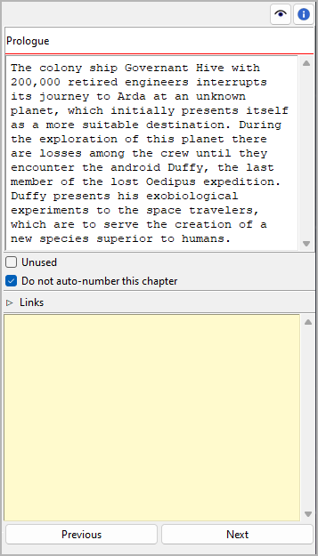

Chapter/part properties
=======================

The Chapter/part properties view opens in the right pane
when you select a chapter or a part in the tree.
You can edit the properties of the selected chapter or part.

.. hint::
   You can change any chapter into a part or vice versa via the **Change
   Level** entry in the context menu, the **Part** menu, or the **Chapter** 
   menu.
   

Title and description
---------------------

Title and description are displayed in an editable "index card".

The editing of the title can be completed by pressing the ``Enter`` key.
Changes to the description are applied when the mouse is clicked
anywhere outside the text input field.

.. note::
   Depending on your `Book settings <book_view.html#auto-numbering>`_, 
   *novelibre* might overwrite the title the next time the tree is refreshed.
   Thus, you don't need to edit the capter/part title, if auto numbering is
   activated and the selected chapter or part is not excluded from 
   auto numbering (see below).

Unused
------

With te **Unused** checkbox, you can change the `chapter type
<basic_concepts.html#part-chapter-section-types>`__.

Do not auto-number this chapter/part
------------------------------------

If this checkbox is ticked, the selected chapter or part will be excluded
from `auto numbering <book_view.html#auto-numbering>`_, and the title
you enter manually will persist.

Links
-----

Expand or collapse this frame by clicking on the label.

.. figure:: _images/world_view02.png
   :alt: Screenshot
   
This is a list for image and research document links.

Although *novelibre* holds some character/location/item data, it is
not the right application for extensive world building. For this,
you may want to use more powerful software, like `Zim Desktop Wiki
<https://zim-wiki.org/>`__. In this case, *novelibre* allows you to
create links to the text files that will take you quickly to the right
places in the wiki.

Or you have collected some images that could inspire you when writing.
Then simply create links to these images to open them with your
system's standard image viewer.

.. tip::
   If you have collected several images for a character in a folder 
   that your standard image viewer can browse through, a single link 
   to any image file is sufficient.  
   
The links are displayed in a list in the order they are entered.

Add Link
   When clicking on |Add|, a file selection dialog opens. The selected
   file will be added to the link list.

   .. hint::
      By default, the dialog shows image files. For other file types, 
      change the selector in the lower right corner. 
      
      .. figure:: _images/filePicker01.png
         :alt: Screenshot
         
         Windows 10 Explorer screenshot

Remove Link
   When clicking on |Remove| or pressing the ``Del`` key,
   the selected link is removed from the list.

Open Link
   When double-clicking on a link, or clicking on |Goto|,
   the link is opened with the standard application for the link's file type.

   .. hint::
      If you want to open certain linked files with another application than the 
      standard application, you can provide a *novelibre* "launcher" setting. 
      For this, just create a text file named **launchers.ini** in the 
      ``.novx/config``  directory (where all configuration files are stored).
      Here you can assign applications to the file extensions.
      
      Zim desktop wiki pages are a special case. 
      For this, the Zim program is assigned to the `.zim` extension. 
      
      This example shows a setting that makes *novelibre* open text files
      with the *Zim Desktop Wiki* application instead of the standard text 
      editor: 
      
      ::
     
         [SETTINGS]
         .zim = C:/Program Files (x86)/Zim Desktop Wiki/zim.exe 
         
      .. figure:: _images/launchers.png
         :alt: Screenshot
         
         Windows 10 Explorer screenshot

.. |Add| image:: _images/add.png
.. |Goto| image:: _images/goto.png
.. |Remove| image:: _images/remove.png

"Sticky note"
-------------

The yellow text area is for notes. Changes are applied
when the mouse is clicked anywhere outside the text input field.

When the "sticky note" of a section contains text, "N" is
displayed in the tree view as a reminder. If the branch of a chapter
with sections containing notes is collapsed, the "N" is displayed
in the chapter row.

.. note::
   The "sticky notes" are only for working with *novelibre*.
   They are not meant to be exported into a document.

Navigation buttons
------------------

Chapter view
	- **Previous** moves the selection to the previous chapter in the tree.
	- **Next** moves the selection to the next chapter in the tree.

Part view
	- **Previous** moves the selection to the previous part in the tree.
	- **Next** moves the selection to the next part in the tree.
