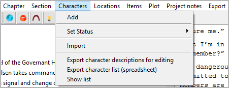
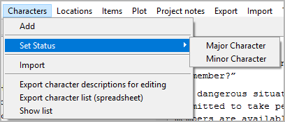

Characters menu
===============

**Character operation**

Add
---

**Add a new character**

With **Characters > Add**
you can add a `character <basic_concepts.html#characters-and-story-world>`__
to the tree.

-  If a character is selected, the new character is placed after the
   selected one.
-  Otherwise, the new character is placed at the last position.
-  The new character has an auto-generated title. You can change it in
   the right pane.
-  The status of newly created characters is *minor*.

Set Status
----------

**Set the character status**

With **Characters > Set Status**,
you can make the selected character *major* or *minor*.
Major characters are highlighted in the tree view.

.. note::
   The character status is only for visual distinction. It has no
   influence on the program functions. Nevertheless, you can use it
   to mark viewpoint characters or characters with their own arcs.

Import
------

**Import characters from another project**

With **Characters > Import**,
you can import a selection of characters from another project.
First you select an XML file containing the character data.
Then you select the characters you want to add to the current project.

.. hint::
   To create an XML character data file for the current project, 
   use **Export > XML data files**.

Export character descriptions for editing
-----------------------------------------

**Export an ODT document that can be imported again after editing**

With **Characters > Export character descriptions for editing**,
you can create a text document that contains
character descriptions, bio, goals, and notes that can be edited in
Office Writer and reimported.
File name suffix is ``_characters_tmp``.

Export character list (spreadsheet)
-----------------------------------

**Export an ODS document that can be imported again after editing**

With **Characters > Export character list (spreadsheet)**,
you can create a spreadsheet that contains
a character list that can be edited with *Calc* and reimported.
File name suffix is ``_charlist_tmp``.

.. note::
   You can reorder, hide or delete columns and rows 
   without affecting the reimport. 
   Only the first column and the first row, which are hidden by default, 
   must not be changed as they contain the structural information 
   for the import. 

Show list
---------

**Show an HTML report with characters data**

With **Characters > Show list**,
you can create a list-formatted HTML file that contains
a character list,
and launch your system’s web browser for displaying it.

.. note::
   The report is a temporary file, auto-deleted on program exit.
   If needed, you can have your web browser save or print it.
