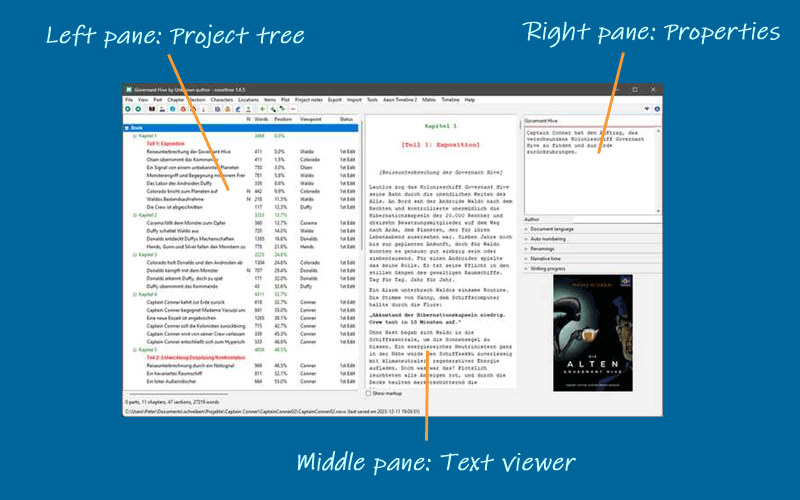
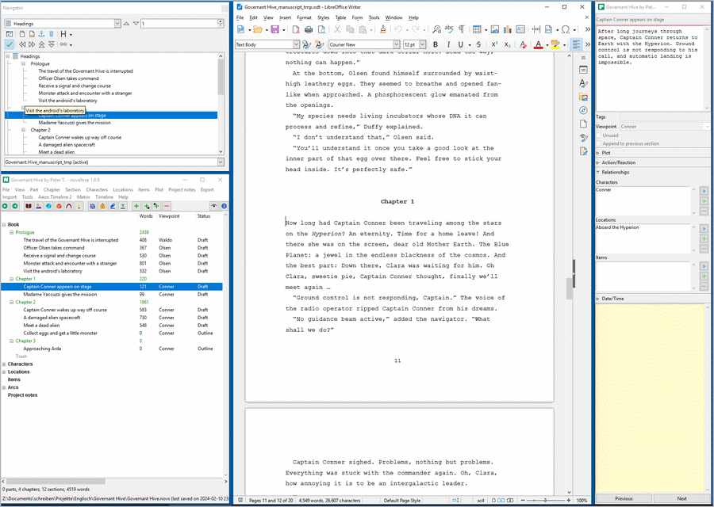

Desktop overview
================

The *novelibre* desktop is divided into three panes:

   Desktop

Project tree
------------

The project tree in the left pane shows the organization of the project.

-  The tree elements are color-coded according to the section type (see
   `Basic concepts <basic_concepts.html#part-chapter-section-types>`__).
   *Normal* type sections are highlighted according to the selected coloring
   mode (see *Options* in the `View menu <view_menu.html#coloring-mode>`__).
-  The order of the columns can be changed (see *Options* in
   the `View menu <view_menu.html#columns>`__).
-  Right-clicking on a tree element opens a `context
   menu <tree_context_menu.html>`__ with several options.
-  The type of chapters and sections, as well as the completion status
   of the sections are color coded and can be changed via context menu.

Project tree structure
~~~~~~~~~~~~~~~~~~~~~~

-  The **Book** branch contains the parts, chapters, and sections that
   belong to the novel manuscript.
-  The **Characters/Locations/Items** branches contain descriptions of
   the story world’s elements that can be associated with the book’s
   sections.
-  The **Plot lines** branch contains the `plot lines and plot points
   <plotting.html#defining-plot-lines>`__.
-  The **Project notes** branch contains `project notes
   <project_note_view.html>`__.

Project tree operation
~~~~~~~~~~~~~~~~~~~~~~

Browsing the tree
   *novelibre* has a browsing history for the selected tree elements.
   This allows you to go back and forth e.g. between a section and its
   related characters.

   -  |Go back| selects a node back in the tree browsing history.
   -  |Go forward| selects a node forward in the tree browsing history.

   .. hint::
      On Windows, the "Forward" and "Back" mouse buttons (if any) 
      may also work.

Move tree elements
^^^^^^^^^^^^^^^^^^

Drag and drop while pressing the ``Alt`` key.

.. caution::
   Be aware, there is no "Undo" feature.

Delete tree elements
^^^^^^^^^^^^^^^^^^^^

Select the element to delete and hit the ``Del`` key.

-  Parts and chapters are deleted.
-  Sections are marked "unused" and moved to the "Trash" chapter.
-  Deleting a part has no effect on its subordinate chapters.
-  Deleting a chapter moves its sections to the "Trash" chapter.
-  The "Trash" chapter is created automatically, if needed.
-  When deleting the "Trash" chapter, all its sections are deleted.

Text viewer
-----------

The **Text viewer** in the middle pane shows the part/chapter/section
contents with their titles as headings.

-  You can open or close the middle pane with the Text viewer with
   **View > Toggle Text viewer**, or ``Ctrl``-``T``, or clicking on
   |Toggle Text viewer|.
-  On opening, the text viewer shows the text where the tree is selected.
-  When changing the tree selection, the text moves along.
-  However, the text can be scrolled independently with the vertical
   scrollbar, or the mousewheel.
-  You can select text with the mouse, and copy it to the clipboard with
   ``Ctrl``-``C``.
-  You cannot edit the text in the viewer.
   For this, you might want to install an editor plugin, such as
   `nv_editor <https://github.com/peter88213/nv_editor/>`__.
-  Section text is color-coded according to the section type (see `Basic
   concepts <basic_concepts.html#part-chapter-section-types>`__).
-  With the **Show markup** checkbox, XML markup can be shown/hidden.

Properties
----------

The `Properties <properties.html>`__ in the right pane show properties
and metadata of the element selected in the project tree.

-  The project settings can be made in the *Book* properties view.
-  You can open or close the element properties window with **View >
   Toggle Properties** or ``Ctrl``-``Alt``-``T``, or clicking on
   |Toggle Properties|.
-  On opening, the windows shows the editable properties of the selected
   element.
-  You can detach or dock the element properties window with **View >
   Detach/Dock Properties** or ``Ctrl``-``Alt``-``D``.
-  On closing the detached window, the properties are docked again.

On large screens, you can arrange *novelibre* and *Writer* with detached
windows.

   
   Example: Arranging LibreOffice (middle) with detached Navigator (upper left), 
   and novelibre (lower left) with detached Properties (right) 

.. |Go back| image:: _images/goBack.png
.. |Go forward| image:: _images/goForward.png
.. |Toggle Text viewer| image:: _images/viewer.png
.. |Toggle Properties| image:: _images/properties.png

Menu bar
--------

The bar at the top is the menu bar with the main menu,
which is documented in the `Command reference <command_reference.html>`__.

Toolbar
-------

The second bar from the top is the toolbar with
`buttons for frequently used actions <toolbar.html>`__.

Status bar
----------

The second bar from the bottom is the status bar. It normally displays project
statistics, such as word count. These are overwritten with program messages
when necessary.

- Messages on a green background indicate successful actions.
- Messages on a red background indicate errors or warnings.

.. tip::
   You can restore the normal view at any time by clicking on the status bar.
   

Footer bar
----------

The footer bar at the bottom displays the project file path and the file date.

Change notification
   If there are unsaved changes, the footer bar is highlighted in goldenrod.

Project lock
   If the project is locked, the footer bar is displayed in reversed colors.

