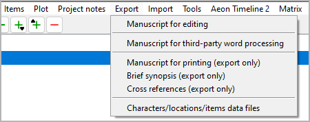
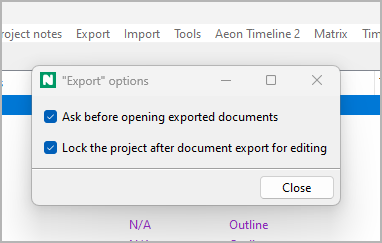

Export menu
===========

**File export**

Manuscript for editing
----------------------

**Export an ODT document that can be imported again after editing**

With **Export >  Manuscript for editing**,
you can create a text document that is split into sections
(to be seen in the Navigator).
File name suffix is ``_manuscript_tmp``.

-  Only “normal” chapters and sections are exported. Chapters and
   sections marked “unused” are not exported.
-  Section titles are invisible, but appear in the *Navigator*.
-  Chapters and sections can neither be rearranged nor deleted.
-  With *Writer*, you can split sections by
   inserting headings or a section divider:

   -  *Heading 1* → New part title. Optionally, you can add a
      description, separated by ``|``.
   -  *Heading 2* → New chapter title. Optionally, you can add a
      description, separated by ``|``.
   -  ``###`` → Section divider. Optionally, you can append the section
      title to the section divider. You can also add a description,
      separated by ``|``.

   .. important:: 
      Documents with split sections are automatically
      discarded after the *novelibre* project is updated.

-  Text markup: Bold and italics are supported. Other highlighting such
   as underline and strikethrough are lost.

Plot grid for editing
---------------------

**Export an ODS document that can be imported again after editing**

With **Export > Plot grid for editing**,
you can create a spreadsheet as described in the
`Plotting with novelibre <plotting.html#plot-grid>`__ chapter,
with a row per section, containing the following data:

- The sequential section number as a hyperlink to the section in the
  manuscript (if any)
- Narrative date
- Narrative time
- Day
- Section title
- Section description
- Viewpoint character
- One column per plot line with the section's plot line notes
- Tags
- A/R
- Goal
- Conflict
- Outcome
- Section notes

.. note::
   Only “normal” sections appear in the plot grid. 
   Sections of the “Unused” type are omitted.

File name suffix is ``_grid_tmp``.

.. note::
   You can reorder, hide or delete columns and rows 
   without affecting the reimport. 
   Only the first column and the first row, which are hidden by default, 
   must not be changed as they contain the structural information 
   for the import. 

Manuscript for third-party word processing
------------------------------------------

**Export an ODT document that can be imported again after editing**

With **Export >  Manuscript for third-party word processing**,
you can create a text document with visible section markers.
File name suffix is ``_proof_tmp``.

.. note::
   This document retains its section information even if it is 
   converted to other formats and back again. This may work with 
   popular commercial word processors and even with web-based word 
   processors such as Google Docs. 

-  Only “normal” chapters and sections are exported. Chapters and
   sections marked “unused” are not exported.
-  The document contains chapter and section headings. However, changes
   will not be reimported.
-  The document contains section ``[scx]`` markers. **Do not touch lines
   containing the markers** if you want to be able to write the document
   back to *novelibre* format.
-  Chapters and sections can neither be rearranged nor deleted.
-  When editing the document, you can split sections by inserting
   headings or a section divider:

   -  *Heading 1* → New part title. Optionally, you can add a
      description, separated by ``|``.
   -  *Heading 2* → New chapter title. Optionally, you can add a
      description, separated by ``|``.
   -  ``###`` → Section divider. Optionally, you can append the section
      title to the section divider. You can also add a description,
      separated by ``|``.

   .. important:: 
      Documents with split sections are automatically
      discarded after the *novelibre* project is updated.

-  Text markup: Bold and italics are supported. Other highlighting such
   as underline and strikethrough are lost.

Manuscript for printing (export only)
-------------------------------------

**Export an ODT document**

With **Export >  Manuscript for printing (export only)**,
you can create a text document for further use,
e.g. when you are finished with *novelibre*.

.. hint::
   In contrast to the manuscript for editing, this document is not divided 
   internally into sections, which could facilitate further processing and 
   reformatting. 

-  The document is placed in the same folder as the project.
-  Document’s **filename**: ``<project name>.odt``.
-  Only “normal” chapters and sections are exported. Chapters and
   sections marked “unused” are not exported.
-  Part titles appear as first level heading.
-  Chapter titles appear as second level heading.
-  Sections are separated by ``* * *``. The first line is not indented.
-  Starting from the second paragraph, paragraphs begin with indentation
   of the first line.
-  Sections marked “attach to previous section” appear like continuous
   paragraphs.
-  Text markup: Bold and italics are supported. Other highlighting such
   as underline and strikethrough are lost.

Brief synopsis (export only)
----------------------------

**Export an ODT document**

With **Export >  Brief synopsis (export only)**,
you can create a text document containing a brief synopsis
with part, chapter, and sections titles only.
File name suffix is ``_brf_synopsis``.

-  Only “normal” chapters and sections are exported. Chapters and
   sections marked “unused” are not exported.
-  Part titles appear as first level heading.
-  Chapter titles appear as second level heading.
-  Section titles appear as plain paragraphs.

Cross references (export only)
------------------------------

**Export an ODT document**

With **Export >  Cross references (export only)**,
you can create a text document containing navigable cross references.
File name suffix is ``_xref``.

The cross references are:

-  Sections per character,
-  sections per location,
-  sections per item,
-  sections per tag,
-  characters per tag,
-  locations per tag,
-  items per tag.

Characters/locations/items data files
-------------------------------------

**Export XML files that can be imported into other projects**

With **Export >  Characters/locations/items data files**,
you can create a set of XML files containing the project’s characters,
locations, and items with all their properties. These files can be used
to transfer the characters, locations, and items to another project.

.. hint::
   To import XML data files from another project, use the **Import**
   command in the **Characters**, **Locations**, or **Items** menu.

Plot description (export only)
------------------------------

**Export an ODT document**

With **Export >  Plot description (export only)**,
you can create a text document that contains the plot-defining elements.
File name suffix is ``_plot``.

Contents:

-  First and second level stages (titles and descriptions).
-  Plot lines (titles and descriptions).
-  Plot points (titles, descriptions, and links to the associated
   section, if any).

Export plot list (spreadsheet)
------------------------------

**Export an ODS document**

With **Export >  Export plot list (spreadsheet)**,
you can create a spreadsheet that contains
sections, plot lines, and plot points.
File name suffix is ``_plotlist``.

The spreadsheet is not meant to be reimported.

.. hint::
   There are hyperlinks to the sections in the manuscript, and to the
   chapters in the plot description.

Show Plot list
--------------

With **Export >  Show Plot list**,
you can create a list-formatted HTML file that contains
sections, plot lines, and plot points,
and launch your system’s web browser for displaying it.

-  The Report is a temporary file, auto-deleted on program exit.
-  If needed, you can have your web browser save or print it.

Options
-------

**Project independent program settings**

With **Export >  Options**,
You can open a dialog for settings concerning the document export.

Ask before opening exported documents
~~~~~~~~~~~~~~~~~~~~~~~~~~~~~~~~~~~~~

This checkbox controls the behavior on document export.

- If ticked, you will be asked whether you want to
  have *novelibre* launch *Writer* or *Calc* with the newly created
  document opened.

- If unticked, *novelibre* will launch *Writer* or
  *Calc* with the newly created document opened right away.

Lock the project after document export for editing
~~~~~~~~~~~~~~~~~~~~~~~~~~~~~~~~~~~~~~~~~~~~~~~~~~

This checkbox controls the behavior on opening documents for editing.

- If ticked, *novelibre* will `lock the project
  <basic_concepts.html#project-lock>`__ when launching *Writer* or *Calc*.

- If unticked, *novelibre* won't lock the project when launching
  *Writer* or *Calc*.
