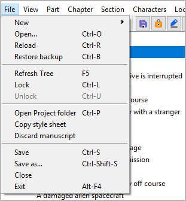
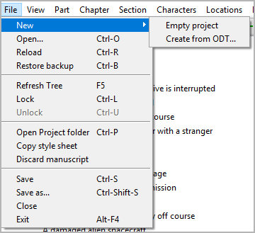
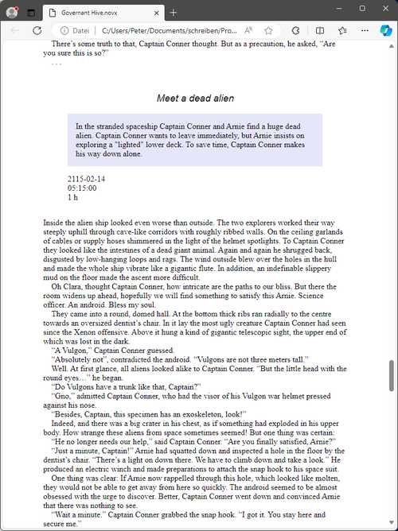

File menu
=========

**File operation**

New
---

**Create a new novel project**

-  You can create a new project with **File > New**. This will open a
   submenu.

.. note:: 
	The submenu can be extended by plugins to add more file types
	from which a *novelibre* project can be created.

Empty project
   -  This will close the current project and create a blank project.
   -  A file select dialog asks for the new project’s file name (novelibre
      v1.4+). If you cancel the dialog, you can select the file name later
      when saving the project.

Create from ODT…
   -  This will close the current project and open a file dialog asking for
      an ODT document to create the new projec from.
   -  The newly created project is saved automatically in the same
      directory as the ODT document, using its file name and the extension
      *.novx*.
   -  If a project with the same file name as the ODT document already
      exists, no new project will be created.
   -  If you select a previously exported document belonging to an existing
      project, this project will be updated and loaded.
   -  The ODT document can either be a **work in progress** i.e. a regular
      novel manuscript with chapter headings and section contents, or an
      **outline**, containing the chapter and section structure with titles
      and descriptions.

   .. important::
        

Open…
-----

**Open a novel project**

You can open an existing project file with **File > Open** or
``Ctrl``-``O``.

.. note::
   When opening a project, the curent project will be closed. You will 
   be asked for saving it, if it has changed.

Reload
------

**Reload the novel project**

You can reload the project with **File > Reload** or ``Ctrl``-``R``.

.. tip::
   This way you can undo changes made in the current session.

.. note::
   If the project has changed on disk since last opened, you will 
   get a warning.

Restore backup
--------------

**Restore the latest backup file**

You can restore the latest backup file with **File > Restore backup**
or ``Ctrl``-``B``. You will get a warning. After restoring the backup,
the backup copy is no longer available.

.. hint::
   You can create a backup copy by saving the project.

Refresh tree
------------

**Enforce tree refresh after making changes**

You can refresh the tree with **File > Refresh tree** or **F5**.

-  “Normal” sections that have been moved to an “Unused” chapter are
   made “Unused”.
-  Parts and chapters are renumbered according to the `Auto numbering
   settings <book_view.html#auto-numbering>`__.
-  The “Trash” chapter is moved to the end of the book, if necessary.

Lock
----

**Protect the project while edited outsides**

You can `lock <basic_concepts.html#project-lock>`__ the project the
project with **File > Lock** or ``Ctrl``-``L``.
The project is saved when modified.

Unlock
------

**Make the project editable**

You can unlock the project with **File > Unlock** or ``Ctrl``-``U``.

Open Project folder
-------------------
**Launch the file manager**

You can launch the file manager with the current project folder with
**File > Open Project folder** or ``Ctrl-P``. This might be helpful,
if you wish to delete export files, open your project with another
application, and so on. In case you edit the project “outsides”,
consider locking it before.

Copy style sheet
----------------

**Provide a css style sheet in the project folder**

You can copy the style sheet *novx.css* into the current project
folder with **File > Copy style sheet**. This allows you to view the
*.novx* project file with a web browser.

   Edge browser screenshot

.. hint::

   Depending on your web browser and your operating system, the
   *content type* resp. *MIME type* of *.novx* files must be registered as
   *“text/xml”*. Under Windows, yo can do this by running the
   ``<home>\.novelibre\add_novelibre.reg`` script.

Discard manuscript
------------------

**Discard the current manuscript by renaming it**

You can add the *.bak* extension to the `current manuscript
<export_menu#manuscript-for-editing>`__ with
**File > Discard manuscript**. This may help to avoid confusion about
changes made with *novelibre* and *Writer*.

Save
----

**Save the project**

You can save the project with **File > Save** or ``Ctrl``-``S``.

.. note::
   If the project has changed on disk since last opened, you will 
   get a warning.

Save as…
--------

**Save the project with another file name/at another place**

You can save the project with another file name/at another place with
**File > Save as…** or ``Ctrl``-``Shift``-``S``. Then a file select dialog
opens.

.. note::
   Your current project remains as saved the last time. Changes since
   then apply to the new project.

Close
-----

**Close the novel project**

You can close the project without exiting the program with **File >
Close**.
When closing the project, you will be asked for saving the project,
if it has changed.

.. note::
   If you open another project, the current project is automatically
   closed.

Quit/Exit
---------

**Exit the program**

-  Under Windows you can exit with **File > Exit** or ``Alt``-``F4``.
-  Otherwise you can exit with **File > Quit** or ``Ctrl``-``Q``.

.. note::
   When exiting the program, you will be asked for saving the project,
   if it has changed.

