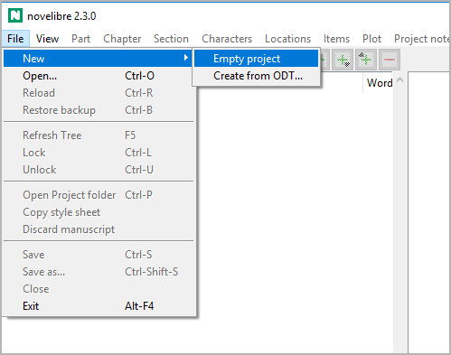
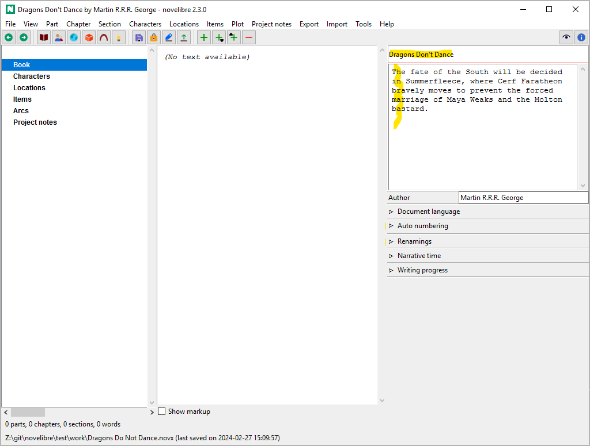
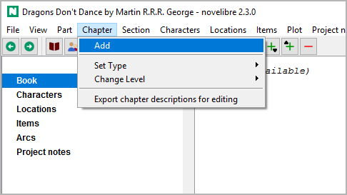
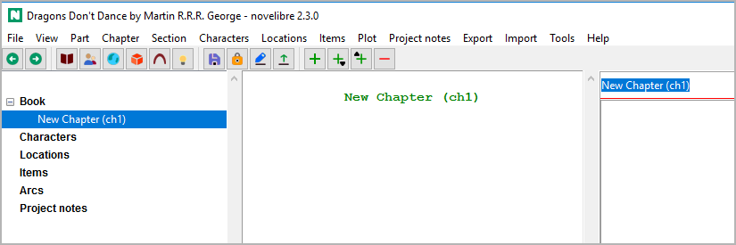
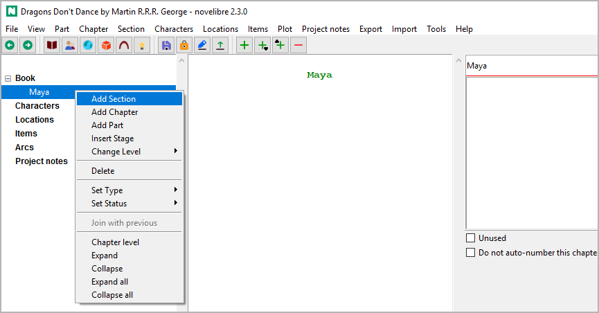
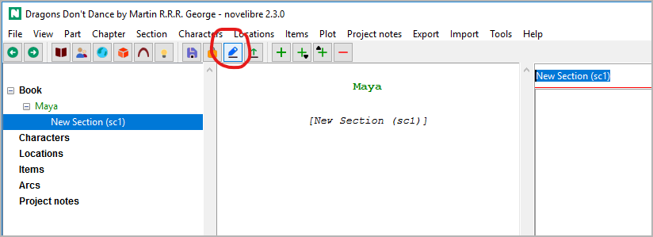
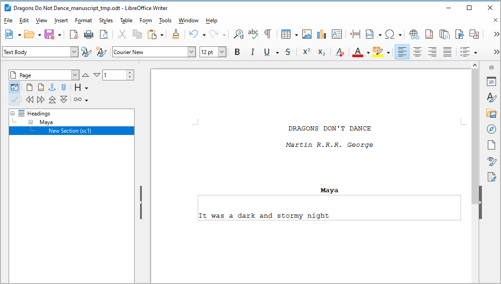
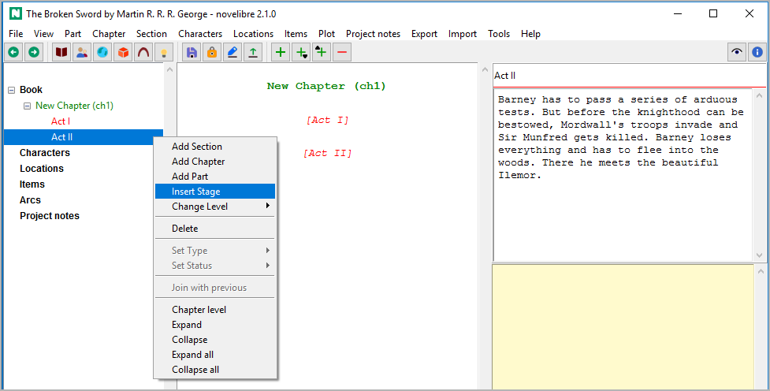
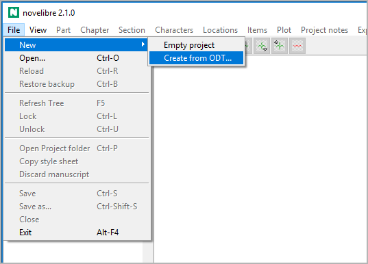

Getting started
===============

Starting from zero
------------------

If you start *novelibre* by dragging a *.novx* file onto the icon,
that project will be opened. Otherwise, the project from the last
session will be automatically reopened, if there is one.

Let's assume that neither is the case, for example when the program
is called up for the very first time after installation.
Let's also assume that we have not yet made any preparations, i.e.
we have neither a work in progress nor an outline of any kind. First
of all, we create a new empty project with **File > New > Empty project**.

   
A file selection dialog opens and asks for the file name and location
of the new project.

.. tip::
   It is advantageous to create a separate folder for the project, as 
   all exported documents are also stored here. This also includes 
   auxiliary files such as timelines or project-related configuration 
   files for tools and plugins. 

It is not mandatory, but we should then enter a title and the author's
name. Perhaps also a description of our idea. To get started right away,
we will postpone the remaining project settings until later.

   
We need at least one section in order to get space to begin writing.
And this must belong to a chapter. So we now create the first
chapter with **Chapter > Add**.

   
After the chapter is created, *novelibre* sets the focus on the chapter
title entry at the top of the right pane. Let's overwrite the default
title.

   
.. hint::
   If you decide to have *novelibre* `auto-number the chapters 
   <book_view.html#auto-numbering>`__, you can skip this and keep the
   default chapter title. 

There are several ways to add a section now. In this example, we
right-click on the chapter, and select **Add section**.

Starting the manuscript immediately
~~~~~~~~~~~~~~~~~~~~~~~~~~~~~~~~~~~

As soon as the new section appears in the tree view, we can export a
manuscript. Just click on the |Export manuscript| toolbar icon.

.. |Export manuscript| image:: _images/manuscript.png

   
Done! *Writer* should now appear with the manuscript open.
Just start writing your novel within the text boundary.

   
We can now continue working with *Writer* `as described on the next
page <writing.html>`__, creating new sections and chapters as we write.

.. tip::
   You can now work on the manuscript document "on the seat of your pants"
   until it makes sense for  you to transfer the whole thing back to 
   *novelibre* in order to create an overview and set up your project 
   organization there.
   
   However, I recommend doing this at least daily at the end of your writing 
   session and exporting a new manuscript document the next day. 
   Then you won't get behind with entering the section titles and content 
   descriptions, and you will get your chapters numbered, if desired. 
   In addition, *novelibre* then saves entries in the daily word count log.
   
   
Creating a chapter structure
~~~~~~~~~~~~~~~~~~~~~~~~~~~~

If you prefer to make a plan first before you start writing, *novelibre* is
the right tool for you.
Then you don't start *Writer* with an empty manuscript, but first create
a framework of empty chapters for which you enter content information.
Or you can leave it at one chapter for the time being and create empty sections
in it, which you can later distribute to chapters.
The results of this preliminary work can be exported as text documents in the
form of synopses, e.g on
`chapter <chapter_menu.html#export-chapter-descriptions-for-editing>`__ or
`section <section_menu.html#export-section-descriptions-for-editing>`__ level.

Creating a dramatic structure
~~~~~~~~~~~~~~~~~~~~~~~~~~~~~

However, you can also start on a more abstract level and first create and
describe stages like acts or steps in order to later insert the sections as
scenes.
For this, you first create at least one chapter. Then create your stages.

The system is described on the `Plotting with novelibre <plotting.html>`__
page.
There you also can learn how to set up multiple strands or character arcs.

.. tip::
   With the `nv_templates plugin
   <https://github.com/peter88213/nv_templates/>`__ you can have 
   *novelibre* set up your new project with a pre-made structure like the
   "Three Act Model" or "Save The Cat". 

Creating a plot grid
~~~~~~~~~~~~~~~~~~~~

If you want to outline your novel using a `plot grid
<plotting.html#plot-grid>`__, you can do this with
*novelibre*:

1. Create an empty new project as described above.
2. Add a single chapter.
3. Select this chapter, then `add multiple sections
   <section_menu.html#add-multiple-sections>`__.
4. If you need a number of new sections above the limit,
   repeat step 3.
   However, it is recommended to start with a few sections
   that are easier to distribute to the chapters to be created later.
   You can extend the plot grid over time.
5. Create the `plot lines <plot_menu.html#add-plot-line>`__ you need.
6. `Export a plot grid <export_menu.html#plot-grid-for-editing>`__
   and fill the table cells.
7. `Import <import_menu.html>`__ the plot grid.
8. `Add more chapters <chapter_menu.html#add>`__ and
   `move the sections <desktop.html#move-tree-elements>`__
   to them.

-----------------

Starting with a work in progress
--------------------------------

Let's assume that you have already written an extensive novel manuscript with
*Writer* and now want to continue with *novelibre*.
In this case you first make sure to set it up in a way, *novelibre* can
recognize its parts, chapters, and sections.

.. important::
   How to set up a work in progress for import
      A work in progress must not have any third level heading.
      
      -  *Heading 1* → Part title.
      -  *Heading 2* → Chapter title.
      -  ``* * *`` → Section divider (not needed for the first section in a
         chapter).
      -  All other text is considered section content.

.. caution::
   Formatting that is not `supported with novelibre 
   <basic_concepts.html#formatting-text>`__ is lost.
   The same applies to images. 
   So if your work depends on a sophisticated layout that is beyond 
   *novelibre's* capabilities, consider using comments as reminders 
   as you write. That will help you doing the special formatting at 
   the end, when you prepare the finished novel for publication. 
   If this is not enough, *novelibre* may not be  the right tool for you.
      
When your manuscript is ready, create your new project
with **File > New > Create from ODT...**.

A file selection dialog opens and asks for the *ODT* document. The new project
will be created in the same directory and named after the manuscript file, but
with the *.novx* extension.

.. caution::
   Once your novel is imported into *novelibre*, your initial *ODT* document is no
   longer needed. So if you want to keep it, you best move it elsewhere, so that
   it is not overwritten by an `exported document 
   <export_menu.html#manuscript-for-printing-export-only>`__ later on. 

Starting with an outline
------------------------

Instead of a work in progress, you also can import an outline made with *Writer*
into *novelibre* to get a novel project with empty, but named and described
chapters and sections.
At first glance, an outline looks the same as a work in progress, but it has
third level headings for the sections, indicating their titles. If *novelibre*
finds third-level headings, it considers all body text to be description.
In this case, formatting doesn't matter.

.. important::
   How to set up an outline for import
      An outline has at least one third level heading.
      
      -  *Heading 1* → Part title.
      -  *Heading 2* → Chapter title.
      -  *Heading 3* → Section title.
      -  All other text is considered to be chapter/section description.

When your manuscript is ready, create your new project
with **File > New > Create from ODT...**.

A file selection dialog opens and asks for the *ODT* document. The new project
will be created in the same directory and named after the manuscript file, but
with the *.novx* extension.

.. caution::
   Once your novel is imported into *novelibre*, your initial *ODT* document is no
   longer needed. So if you want to keep it, you best move it elsewhere, so that
   it is not overwritten by an `exported document 
   <export_menu.html#manuscript-for-printing-export-only>`__ later on. 
      