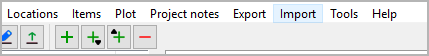
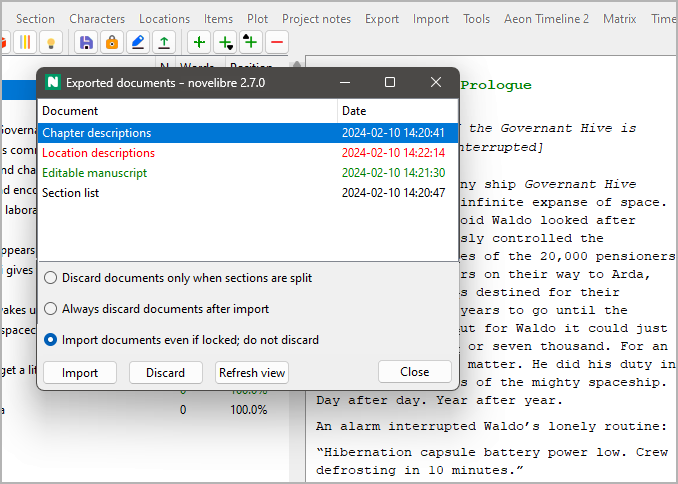

Import menu
===========

**Update the project from previously exported ODT documents**

With the **Import** main menu entry,
you can open a pop-up window with a list containing previously
exported ODT documents that can be re-imported, thus updating the
current project.

-  The document types and dates are shown.
-  Documents that are newer than the project file are highlighted in
   green.
-  Documents that cannot be imported because they are open in
   *Writer* are highlighted in red.
-  You can update the project from a document either by double-clicking
   on the list entry, or by selecting the document and clicking on the
   **Import** button.
-  You can discard documents by selecting them and clicking on the
   **Discard** button.

   .. hint::
      Discard means: Rename by adding the extension *.bak*
      to the file name.
   
-  After closing a listed document in *Writer* while the *Exported
   documents* window is open, you can click on the **Refresh view**
   button.

Discarding documents after updating the project
-----------------------------------------------

Documents with split sections are always automatically discarded
after re-import in order to avoid confusion about the changed
section or chapter structure.
Concerning re-imported documents that do not require modifying
the project structure, you have three choices:

Discard documents only when sections are split
   This is the default behavior.
   The ODF documents are kept for future use.

Always discard documents after import
   After updating the *novelibre* project from an re-imported
   ODF document, this document is automatically discarded.

Import documents even if locked; do not discard
   This is for fast and frequent project updates while keeping
   the ODF documents open in *Writer* or *Calc* for editing.

   .. important::
      If you split sections in your ODT document, you cannot 
      import it while open in *Writer*. 
      This is because *novelibre* cannot discard it when locked
      by *Writer*. 
