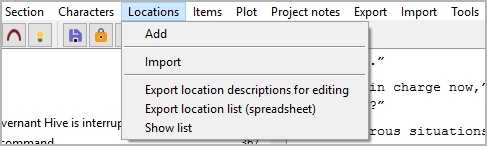

Locations menu
==============

**Location operation**

Add
---

**Add a new location**

With **Locations > Add**,
you can add a `location <basic_concepts.html#characters-and-story-world>`__
to the tree.

-  If a location is selected, the new location is placed after the
   selected one.
-  Otherwise, the new location is placed at the last position.
-  The new location has an auto-generated title. You can change it in
   the right pane.

Import
------

**Import locations from another project**

With **Locations > Import**,
you can import a selection of locations from another project.
First you select an XML file containing the location data.
Then you select the locations you want to add to the current project.

.. hint::
   To create an XML location data file for the current project, 
   use **Export > Characters/locations/items data files**.

Export location descriptions for editing
----------------------------------------

**Export an ODT document that can be imported again after editing**

With **Items > Export location descriptions for editing**,
you can create a text document that contains
location descriptions that can be edited with *Writer* and reimported.
File name suffix is ``_locations_tmp``.

Export location list (spreadsheet)
----------------------------------

**Export an ODS document that can be imported again after editing**

With **Items > Export location list (spreadsheet)**,
you can create a spreadsheet that contains
a location list that can be edited with *Calc* and reimported.
File name suffix is ``_loclist_tmp``.

.. note::
   You can reorder, hide or delete columns and rows 
   without affecting the reimport. 
   Only the first column and the first row, which are hidden by default, 
   must not be changed as they contain the structural information 
   for the import. 

Show list
---------

**Show an HTML report with locations data**

With **Locations > Show list**,
you can create a list-formatted HTML file that contains
a location list,
and launch your system’s web browser for displaying it.

.. note::
   The report is a temporary file, auto-deleted on program exit.
   If needed, you can have your web browser save or print it.

