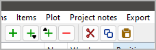

|external-link| `German <https://peter88213.github.io/nvhelp-de/nv_clipboard/>`_

.. |external-link| image:: ../_images/external-link.png

-----------------

============
nv_clipboard
============

**User guide**

This page refers to the latest `nv_clipboard
<https://github.com/peter88213/nv_clipboard/>`__ release.
You can open it with **Help > Collection plugin Online help**.

The plugin adds two buttons to the *novelibre* `toolbar <../toolbar.html>`__,
and a **Clipboard Online help** entry to the **Help** menu.

Toolbar buttons provided by the nv_clipboard plugin
---------------------------------------------------

..
   |Cut| Move the selected element from the tree to the clipboard.
   Same as ``Ctrl``-``X``. 

|Copy| Copy the selected element to the clipboard.
Same as ``Ctrl``-``C``.

|Paste| Paste the element stored in the clipboard to the tree.
Same as ``Ctrl``-``V``.

You can copy and paste the following tree elements via the system clipboard:

- Parts and chapters,
- sections,
- stages,
- plot lines,
- plot points,
- characters,
- locations,
- items,
- project notes.

.. hint::
   If multiple elements are selected, only the first one will be copied.
   However, if the element has "children", these will also be copied and pasted.

.. attention::
   Relationships are not included when copying to the clipboard.
   This also applies to the section viewpoint.   

.. |Copy| image:: _images/copy.png
.. |Paste| image:: _images/paste.png
