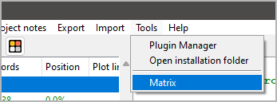

|external-link| `German <https://peter88213.github.io/nvhelp-de/nv_matrix/>`__

.. |external-link| image:: ../_images/external-link.png

-----------------

=========
nv_matrix
=========

**User guide**

This page refers to the latest `nv_matrix
<https://github.com/peter88213/nv_matrix/>`__ release.
You can open it with **Help > Matrix plugin Online help**.

The plugin adds a **Matrix** entry to the *novelibre* **Tools** menu,
and a **Matrix plugin Online help** entry to the **Help** menu.
The Toolbar gets a |Matrix| button.



.. |Matrix| image:: _images/matrix.png


Installing the plugin
---------------------

- Either launch the downloaded **nv_matrix_vx.x.x.pyzw**
  file by double-clicking (Windows/Linux desktop),
- or execute ```python nv_matrix_vx.x.x.pyzw``` (Windows),
  resp. ```python3 nv_matrix_vx.x.x.pyzw``` (Linux)
  on the command line.

*"x.x.x"* means the version number.


.. important::
   Many web browsers recognize the download as an executable file 
   and offer to open it immedately. 
   This starts the installation.
 
   However, depending on your security settings, your browser may 
   initially  refuse  to download the executable file. 
   In this case, your confirmation or an additional action is required. 
   If this is not possible, you have the option of downloading 
   the zip file. 

Start the matrix manager
------------------------

- Open the matrix manager either from the main menu: **Tools > Matrix**,
- or via the |Matrix| button in the toolbar.


Add/remove relationships
------------------------

-  Add/Remove relationships by klicking on the nodes with the ``Ctrl``
   key pressed.

Mouse wheel scrolling
---------------------

-  Use the mouse wheel for vertical scrolling.
-  Use the mouse wheel with the ``Shift`` key pressed for horizontal
   scrolling.

Exit
----

-  Close the window.
