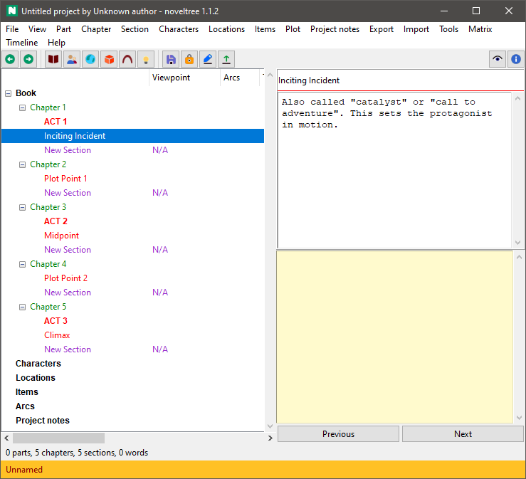

|external-link| `German <https://peter88213.github.io/nvhelp-de/nv_templates/>`__

.. |external-link| image:: ../_images/external-link.png

-----------------

============
nv_templates
============

**User guide**

This page refers to the latest `nv_templates
<https://github.com/peter88213/nv_templates/>`__ release.
You can open it with **Help > Templates plugin Online help**.

Installing the plugin
---------------------

- Unzip the downloaded zipfile into a new folder.
- Move into this new folder and launch **setup.pyw**. This installs the plugin.

The plugin adds a **Story Templates** entry to the *novelibre* **Tools** menu,
a **Create from Template** entry to the **File > New** submenu,
and a **Template plugin Online Help** entry to the **Help** menu.

Command reference
-----------------

File > New
~~~~~~~~~~

Create from template
^^^^^^^^^^^^^^^^^^^^

This creates a new project with the narrative structure from a Markdown
template file.

-  First, a file select dialog asks for the new project’s file name
   (novelibre v1.4+). If you cancel the dialog, you can select the file
   name later when saving the project.
-  Then a second file select dialog asks for the template file to apply.

Tools > Story Templates
~~~~~~~~~~~~~~~~~~~~~~~

Load
^^^^

This loads the narrative structure from a Markdown template file.

-  A file select dialog asks for the template file to apply.

Save
^^^^

This saves the narrative structure to a Markdown template file.

-  A file select dialog asks for the new template’s file name.

Open folder
^^^^^^^^^^^

This opens the templates folder with the OS file manager, so you can
manage and edit the templates.

Conventions
-----------

In *novelibre*, you can define a narrative structure with stages. See
`Plotting with novelibre <../plotting.html>`__.
*nv_templates* faciliates the reuse of narrative structures.

Markdown file structure
~~~~~~~~~~~~~~~~~~~~~~~

The *Story Template* Markdown file defines such a structure with
headings and ordinary text.

First level heading for top level stages, e.g. acts
^^^^^^^^^^^^^^^^^^^^^^^^^^^^^^^^^^^^^^^^^^^^^^^^^^^

The first level heading begins with ``#``, followed by a space and a
stage title.

Second level heading for minor stages or turning points
^^^^^^^^^^^^^^^^^^^^^^^^^^^^^^^^^^^^^^^^^^^^^^^^^^^^^^^

The second level heading begins with ``##``, followed by a space and a
stage title.

Ordinary text
^^^^^^^^^^^^^

Any text under a heading is used as a description for the element
generated from the heading.

Example
^^^^^^^
.. highlight:: markdown

:: 

   # ACT 1

   Setup

   ## Inciting Incident

   Also called "catalyst" or "call to adventure".
   This sets the protagonist in motion.

   ## Plot Point 1

   "Point of no return": The protagonist engages with the action 
   the inciting incident has created.

   # ACT 2

   Confrontation

   ## Midpoint

   The main turning point. A significant event, changing the 
   development of things from good to bad, or vice versa.

   ## Plot Point 2

   The aftermath of the Midpoint crisis.
   What changes the protagonist from "passenger" to "driver".  

   # ACT 3

   Resolution

   ## Climax

   The final moment of the story's conflict.

This file generates the following structure in an empty project:

