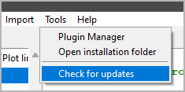
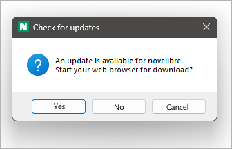
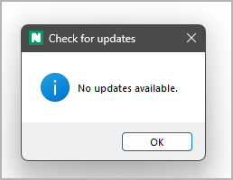

|external-link| `German <https://peter88213.github.io/nvhelp-de/nv_updater/>`__

.. |external-link| image:: ../_images/external-link.png

-----------------

==========
nv_updater
==========

**User guide**

This page refers to the latest `nv_updater
<https://github.com/peter88213/nv_updater/>`__ release.
You can open it with **Help > Update checker Online help**.

The plugin adds a **Check for updates** entry to the *novelibre* **Tools** menu,
and an **Update checker Online help** entry to the **Help** menu.

Start the update checker
------------------------

Open the update checker from the main menu: **Tools > Check for updates**.

If an update is found, a message pops up.

You can choose:

   -  **Yes** starts your web browser with the update URL.
   -  **No** skips this update.
   -  **Cancel** cancels the update check.

.. important::
   The *nv_updater* plugin only initiates the download process via the
   system web browser. If a download directory is preset, all zip files
   with the downloaded releases will end up there. You then perform the
   actual installation manually as usual.

If no update is found, a message pops up at the end.

.. important::
   To take effect, update installations require a *novelibre* restart. 
