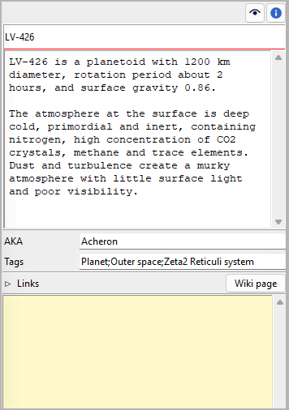

|external-link| `German <https://peter88213.github.io/nvhelp-de/nv_zim/>`_

.. |external-link| image:: ../_images/external-link.png

-----------------

======
nv_zim
======

**User guide**

This page refers to the latest `nv_zim
<https://github.com/peter88213/nv_zim/>`__ release.
You can open it with **Help > Zim connection Online help**.

*nv_zim* is a plugin that connects *novelibre* projects with a
*Zim Desktop Wiki*.
This is mainly intended for world building documentation.

The plugin adds an **Zim Desktop Wiki** entry to the *novelibre* **Tools** menu,
and a **Zim connection Online help** entry to the **Help** menu.
The property views of characters, locations, items, and book
get a **Wiki page** button.
The Toolbar gets a |Zim| button.

.. |Zim| image:: _images/zim.png

Setting up Zim Desktop Wiki
---------------------------

General
-------

To launch the `Zim Desktop Wiki <https://zim-wiki.org/>`__
application, *nv_zim* must know the location of its installation.
At program startup, it checks the *launchers.ini* file in the
*novelibre* configuration directory.
Here is an example with a Windows entry:

::

   [SETTINGS]
   .zim = C:/Program Files (x86)/Zim Desktop Wiki/zim.exe

If this file doesn't exist, or the path doesn't fit,
the program searches the default installation paths for the 32-bit
and the 64-bit versions under Windows.
If this fails, it opens a file selection dialog, asking for the location.
So under Windows, the users may have nothing to do.

Linux users might want to find out where the Zim installation is located
on their system, and either enter this path into a self-made
**~/.novx/launchers.ini** file, or select it with the file picker dialog
when asked.

Zim notebooks as project wikis
------------------------------

The *nv_zim* plugin extends the *novelibre* user interface, so you can
conveniently launch the *Zim Desktop Wiki* application with a
project-related notebook or a context-related wiki page.
Basically, this works with any Zim notebook, even with pages that belong
to different notebooks.
However, it is recommended to create a notebook called *project wiki*
linked with the current *novelibre* project, or with multiple projects
that belong to a series.
Then the program can automatically generate missing pages in this notebook.

File locations
~~~~~~~~~~~~~~

Project wikis may be located anywhere. However, auto-created ones are
put into a subdirectory of the *novelibre* project, named ``<project name>_zim``.

- If you later move the project wiki to another location,
  the next time you open it from within *novelibre* you can select it
  with a file selection dialog and link to it again.
- If you move the project wiki to another location together with the *novelibre* project,
  the program can automatically correct the wiki links.
- Even if you leave the project wiki where it is, but move the *novelibre* project
  somewhere else, the program can automatically correct the wiki links.

Notebook structure
~~~~~~~~~~~~~~~~~~

Auto-generated project wikis have a "flat" structure, which means:
all wiki pages are located in the Zim notebook's *Home* folder.
Groupings and tree structures can be created using links on appropriately structured
overview pages. Compared to a folder structure, this has the advantage that each
page can be categorized under several different aspects.
If you prefer a hierarchical structure instead, you can subsequently move
auto-generated wiki pages with *Zim*, but you may have to renew the link
in *novelibre* via the selection dialog.

Tags
~~~~

*novelibre* offers the option of assigning tags to characters, locations, and items.
When *nv_zim* auto-generates a wiki page, it inserts existing tags in the appropriate
notation for *Zim*, allowing the application to group and link pages according to the
categories represented by the tags.

Wiki links in novelibre
~~~~~~~~~~~~~~~~~~~~~~~

*novelibre* saves the file paths of the project wiki and the wiki pages in the
*.novx* file, if the project is not locked at the time of linking.
Otherwise, the program only remembers these file paths for the current session,
so as not to change the locked project.
However, if you subsequently unlock the project and reopen the wiki or a page,
it will automatically save the file paths and display a corresponding message
on the status bar.

.. tip::
   If you want to link more than one wiki page with a character, location, item, 
   or the book, you can use regular `links <../world_view.html#links>`__.
   When the *nv_zim* is installed, *novelibre* will recognize wiki pages 
   among the links and open them with the *Zim* application.

Zim Desktop Wiki menu
---------------------

Open project wiki
~~~~~~~~~~~~~~~~~

With **Tools > Zim Desktop Wiki > Open project wiki**,
or clicking on the |Zim| button on the toolbar,
you can open the Zim notebook linked with the project.

If there is no link yet, or if the saved link address is not valid,
you will be asked whether you want to open an existing wiki or create a new one:

Browse
   this opens a file picker dialog to search for a Zim wiki file
   with the extension *.zim*.
   Zim is launched with the selected project wiki open.

   .. note::
      The selected file will be linked as the project wiki, if the project is not locked. 
      If the project is locked, you can open the project wiki from within *novelibre* 
      during the current session, but you may have to re-select it in the next session. 

Create
   this auto-creates a new blank Zim notebook in a subdirectory of the project directory,
   and opens it with Zim.

   .. note::
      The new *.zim* file will be linked as the project wiki, if the project is not locked. 
      If the project is locked, you can open the project wiki from within *novelibre* 
      during the current session, but you may have to re-select it in the next session. 

Cancel
   Aborts the operation without launching Zim.

.. hint::
   If you want to open the project wiki or a wiki page from within *novelibre*, 
   but don't see any reaction, please take a look at the taskbar and see whether
   the *Zim Desktop Wiki* application is already open, but is covered by other open windows, 
   e.g. by *novelibre*. 
   In this case, the "Zim" window is not automatically lifted to the foreground. 

Create project wiki
~~~~~~~~~~~~~~~~~~~

With **Tools > Zim Desktop Wiki > Create project wiki**
you can create a new Zim notebook in a subdirectory of the project directory
and open it with Zim.
The generated project wiki contains pages for the book and for all characters,
locations, and items.
If there is already a Zim notebook in the target directory, this directory
is automatically renamed and kept as a backup.

.. note::
   The new *.zim* file will be linked as the project wiki, if the project is not locked. 
   If the project is locked, you can open the project wiki from within *novelibre* 
   during the current session, but you may have to re-select it in the next session. 

Remove wiki links
~~~~~~~~~~~~~~~~~

With **Tools > Zim Desktop Wiki > Remove wiki links** you can remove saved wiki links
from the project file. This takes effect when saving the next time.

A submenu offers two options:

Selected pages
   This will remove the Zim wiki links of the selected elements.
   This command only refers to linked pages, but not to the project wiki.

All
   This will remove all Zim wiki links.
   This command refers both to linked pages and to the project wiki.

Book/Characters/Locations/Items properties
------------------------------------------

"Wiki page" button
~~~~~~~~~~~~~~~~~~

By clicking on this button you open a linked wiki page with Zim.

If no wiki page is linked yet, the program first tries to find a page in the project wiki
whose name matches the title of the book, the location or the item,
or the full name of the character, if known, otherwise the short name.

If no project wiki has been defined yet, the program first asks for the project wiki
and gives you the option of selecting or creating it (see above).
You will then be asked whether you want to open an existing wiki page or create a new one:

Browse
   this opens a file picker dialog to search for a Zim page file
   with the extension *.txt*.
   Zim is launched with the selected wiki page open.

   .. note::
      The selected file will be linked with the element currently selected in *novelibre*, 
      if the project is not locked. 
      If the project is locked, you can open the wiki page from within *novelibre* 
      during the current session, but you may have to re-select it in the next session. 

Create
   this auto-creates a new wiki page as a part of the project wiki,
   and opens it with Zim.

   .. note::
      The new *.txt* file will be linked with the element currently selected in *novelibre*, 
      if the project is not locked.  
      If the project is locked, you can open the wiki page from within *novelibre* 
      during the current session, but you may have to re-select it in the next session. 

Cancel
   Aborts the operation without launching Zim.
