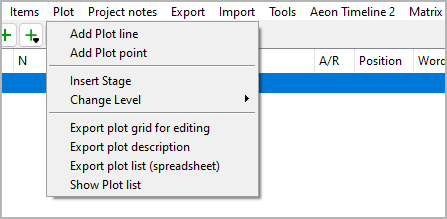
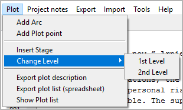

Plot menu
=========

**Plot elements operation**

Add Plot line
-------------

**Add a new plot line to the story**

With **Plot > Add plot line**,
you can add a project note to the tree .

.. note::

   -  If a plot line is selected, the new item is placed after the selected one.
   -  Otherwise, the new plot line is placed at the last position.
   -  The new plot line has an auto-generated title. You can change it in the
      right pane.

Add Plot point
--------------

**Add a new Plot point to the selected plot line**

With **Plot > Add Plot point**,
you can add a plot point to a plot line.

.. note::

   - If a plot point is selected, the new plot point is placed after the selected one.
   - If a plot line is selected, the new plot point is placed at the last position.
   - Otherwise, no new plot point is generated.
   - The new plot point has an auto-generated title. You can change it in
     the right pane.

Insert Stage
------------

**Insert a stage between the sections**

With **Plot > Insert Stage**,
you can insert a stage after the selected chapter or section.

.. hint::
   By default, the new stage is on the second level. 
   You can change the level to first (see below).

Change Level
------------

**Change the level of the selected stages**

With **Plot > Change Level**,
you can change the level of the selected stages.

-  **1st Level** is displayed in bold face.
-  **2nd Level** is displayed in regular font.

.. note::
   The stage level is only for visual distinction. It has no
   influence on the program functions. 

Export plot description
-----------------------

**Export an ODT document**

With **Plot > Export plot description**,
you can create a text document that contains
stages, plot lines, and plot points, each with description.
File name suffix is ``_plot``.

Export plot list (spreadsheet)
------------------------------

**Export an ODS document**

With **Plot > Export plot list (spreadsheet)**,
you can create a spreadsheet with a row for each section
and a column for each plot line.
Associations between plot lines and sections are color-highlighted.
Plot point titles are displayed.
File name suffix is ``_plotlist``.

.. hint::
   The plot line titles and the section titles are hyperlinked to 
   the respective descriptions in other exported documents, if any.

.. figure:: _images/plot_menu04.png
   :alt: LibreOffice screenshot

   LibreOffice screenshot. Note the hyperlink from the plot line title in the
   plot list (left) to the plot line in the plot description (right). 

.. important::
   Hyperlinks in ODS spreadsheets are absolute within the file system, 
   so they might not work after moving the location of your project file
   to another folder or computer. In this case, you will have to 
   export the spreadsheet anew.  

Show Plot list
--------------

**Show an HTML report with plot elements**

With **Plot > Show Plot list**,
You can create a list-formatted HTML file that contains
a plot list similar to the ODS plot list (see above),
but without any hyperlinks,
and launch your system’s web browser for displaying it.

.. figure:: _images/plot_menu03.jpg
   :alt: Edge browser screenshot

   Edge browser screenshot

.. note::
   The report is a temporary file, auto-deleted on program exit.
   If needed, you can have your web browser save or print it.

