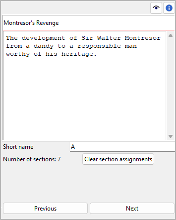
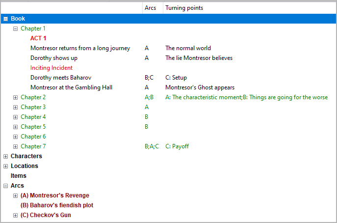

Plot line properties
====================

The Plot line properties view opens in the right pane when you
select a `plot line <plotting.html#defining-plot-lines>`__ in the tree.

Title and description
---------------------

Title and description are displayed in an editable "index card".

The editing of the title can be completed by pressing the ``Enter`` key.
Changes to the description are applied when the mouse is clicked
anywhere outside the text input field.

Short name
----------

Be sure to enter a short name to be displayed as a reference in the tree.
A single character like "A", "B", "C" is recommended.

   Example: Plot line short names as displayed in the tree
   
Section assignments
-------------------

The number of sections that belong to the selected plot line is shown
below the "Short name" entry. The assignments can be made in the
`section properties view <section_view.html#plot>`__.
You can unlink all sections from the selected plot line at once by
clicking on the **Clear section assignments** button.

.. hint::
   A convenient way to manage and keep track of section assignments is 
   offered by the `nv_matrix plugin 
   <https://github.com/peter88213/nv_matrix/>`__. 

Navigation buttons
------------------

- **Previous** moves the selection to the previous plot line in the tree.
- **Next** moves the selection to the next plot line in the tree.

