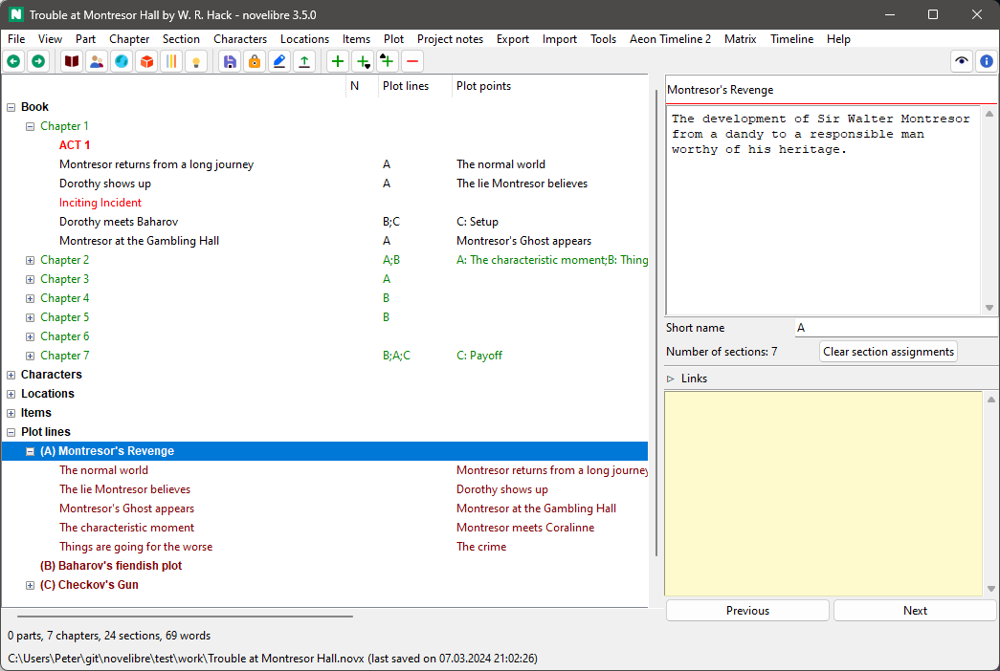
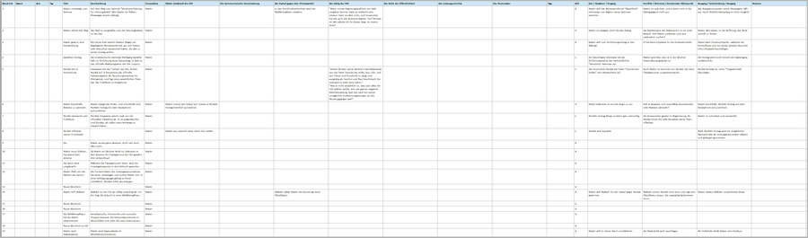

Plotting with novelibre
=======================

Applying a story structure model
--------------------------------

If you want to divide a story into stages according to a structure model
(e.g. the *Three Act Model*, or the *Save The Cat* beatsheet), just
insert the stages between the regular sections at the beginning of each
phase. This gives you color-coded subheadings in the tree view.

.. figure:: _images/acts01.png
   :alt: Acts

   Acts

With the `nv_templates plugin
<https://github.com/peter88213/nv_templates/>`__ you can
load pre-made story structure models from Markdown template files, and
you can save the story structure of your project for reuse.

-----------------

Defining plot lines
-------------------

*novelibre* provides *plot lines* as a powerful and flexible concept for
plotting.

   Plot lines

"Plot line" can mean a variety of things: narrative strand,
thread, character arc, storyline, subplot, sequence of cause and effect,
sequence of setup and payoff, and so on.
You can think of a plot line as a line on which plot points are arranged
that characterize the progression of the story.
These plot points can be assigned to sections to indicate the section’s
relevance to the plot.

-  *novelibre* lets you define any number of plot lines.
-  Any number of sections can be assigned to each plot line.
-  Any number of plot lines can be assigned to each section.
-  Each plot line can contain any number of plot points.
-  Each plot point can be assigned to exactly one section.
-  Any number of plot points can be assigned to each section.

The association of sections and plot points is shown in the "Plot points"
column of the tree view.

You can use plot lines to establish named connections between sections, such as
*setup -> payoff*, so you can keep track of this relationship even if
the sections are far away from each other.

.. figure:: _images/causality01.png
   :alt: Example

   Setup/payoff example

Plot grid
---------

The *novelibre* `plot grid
<plot_menu.html#export-plot-grid-for-editing>`__ is a spreadsheet with a row for
each section, and a set of plot-relevant section metadata in the columns.
The first visible column contains links to the sections in the
`manuscript <export_menu.html#manuscript-for-editing>`__.
Each plot line has its own column in the plot grid,
Where the `plot line notes <section_view.html#plot-lines>`__ are shown.
The plot grid offers you a convenient way to enter the plot line notes by
seeing the big pictures of your plot construction.

   Plot grid example

.. hint::
   You can assign a section to a plot line by entering text
   in the corresponding *Plot line notes* cell of the plot grid. 

