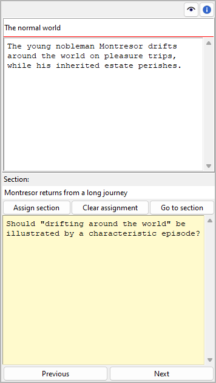

Plot point properties
=====================

The Plot point properties view opens in the right pane when you
select a plot point in the tree.

Title and description
---------------------

Title and description are displayed in an editable "index card".

The editing of The editing of the title can be completed by pressing the ``Enter`` key.
Changes to the description are applied when the mouse is clicked
anywhere outside the text input field.

Assigned section
----------------

You can connect the plot point to a section in the book.
The label below "Section" displays the section title.

Assign section
   When clicking on the **Assign section** button, the "Pick mode"
   is activated, and the cursor changes to a "plus" shape. By clicking
   on a section, this section will be assigned to the plot point.

   .. hint::
      You can exit the "Pick mode" without selecting a section by
      clicking on the highlighted status bar, or by pressing the ``Esc``
      key. 

Clear assignment
   If a section is assigned to the plot point, you can disconnect it
   by clicking on the **Clear assignment** button.

Go to section
   When clicking on the **Go to section** button,
   the selected section is opened and its properties are displayed.

   .. hint::
      You can go back to the initially selected plot point with |Go Back|. 

.. |Go back| image:: _images/goBack.png

Links
-----

Expand or collapse this frame by clicking on the label.

.. image:: _images/world_view02.png
   :alt: Screenshot
   
This is a list for image and research document links.

Although *novelibre* holds some character/location/item data, it is
not the right application for extensive world building. For this,
you may want to use more powerful software, like `Zim Desktop Wiki
<https://zim-wiki.org/>`__. In this case, *novelibre* allows you to
create links to the text files that will take you quickly to the right
places in the wiki.

Or you have collected some images that could inspire you when writing.
Then simply create links to these images to open them with your
system's standard image viewer.

.. tip::
   If you have collected several images for a character in a folder 
   that your standard image viewer can browse through, a single link 
   to any image file is sufficient.  
   
The links are displayed in a list in the order they are entered.

Add Link
   When clicking on |Add|, a file selection dialog opens. The selected
   file will be added to the link list.

   .. hint::
      By default, the dialog shows image files. For other file types, 
      change the selector in the lower right corner. 
      
      .. image:: _images/filePicker01.png
         :alt: Screenshot
         

Remove Link
   When clicking on |Remove| or pressing the ``Del`` key,
   the selected link is removed from the list.

Open Link
   When double-clicking on a link, or clicking on |Goto|,
   the link is opened with the standard application for the link's file type.

   .. hint::
      If you want to open certain linked files with another application than the 
      standard application, you can provide a *novelibre* "launcher" setting. 
      For this, just create a text file named **launchers.ini** in the 
      ``.novx/config``  directory (where all configuration files are stored).
      Here you can assign applications to the file extensions.
      
      Zim desktop wiki pages are a special case. 
      For this, the Zim program is assigned to the `.zim` extension. 
      
      This example shows a setting that makes *novelibre* open text files
      with the *Zim Desktop Wiki* application instead of the standard text 
      editor: 
      
      ::
     
         [SETTINGS]
         .zim = C:/Program Files (x86)/Zim Desktop Wiki/zim.exe 
         
      .. image:: _images/launchers.png
         :alt: Screenshot
         
.. |Add| image:: _images/add.png
.. |Goto| image:: _images/goto.png
.. |Remove| image:: _images/remove.png

"Sticky note"
-------------

The yellow text area is for notes. Changes are applied
when the mouse is clicked anywhere outside the text input field.

When the "sticky note" of a plot point contains text, "N" is
displayed in the tree view as a reminder. If the branch of a
plot line with plot points containing notes is collapsed,
the "N" is displayed in the plot line row.

Navigation buttons
------------------

- **Previous** lets you navigate to the previous plot point in the tree.
- **Next** lets you navigate to the next plot point in the tree.

