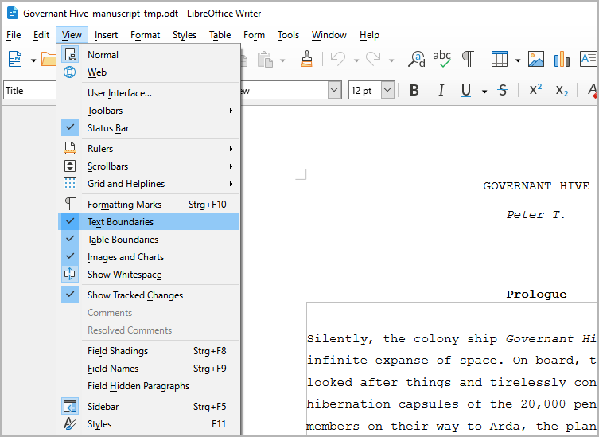

Preparations
============

Setting up novelibre
--------------------

If *novelibre* were a commercial application, all the
steps described below would be performed automatically
by the setup program. On Windows, for instance, this would
then be an *.exe* or *.msi* file that must be executed
with special authorizations and may even require a costly
certificate in order to be approved for download and
installation.

There is also the problem that a separate setup program would
have to be created and maintained for each operating system.
For Linux, it would be necessary to provide installation
packages or images, whereby there are a multitude of different
standards.

Because I don't run a software business, but am just a
hobbyist and rather want to write novels, I've decided to
go a different route: I provide an executable Python zip archive
that works the same way on all operating systems
if Python is installed correctly.
No Internet connection is required to install and operate *novelibre*.

The very last setup steps, which vary depending
on the operating system and may also require special authorizations,
must be carried out by the intrepid users themselves.
I do what I can to make these steps easier, and provide
detailed instructions for Windows below.
Enjoy!

Installing the application
~~~~~~~~~~~~~~~~~~~~~~~~~~

Step 1
   - Either launch the downloaded **novelibre_vx.x.x.pyzw**
     file by double-clicking (Windows/Linux desktop),

     .. figure:: _images/preparations11.png
        :alt: Example (Windows Explorer)

        Example (Windows Explorer)

   - or execute

     ```python novelibre_vx.x.x.pyzw``` (Windows), resp.

     ```python3 novelibre_vx.x.x.pyzw``` (Linux) on the command line.

     .. figure:: _images/preparations12.png
        :alt: Example (Windows command line)

        Example (Windows command line)

   *"x.x.x"* means the version number.

   In both cases, a pop-up window should appear indicating
   that the installation was successful.

   .. figure:: _images/preparations13.png
      :alt: Example (Windows)

      Example (Windows)

   .. important::
      Many web browsers recognize the download as an executable file 
      and offer to open it immedately. 
      This starts the installation.
    
      .. figure:: _images/preparations14.png
         :alt: Beispiel (Chrome browser)
         
         Example (Chrome browser)
      
      However, depending on your security settings, your browser may 
      initially  refuse  to download the executable file. 
      In this case, your confirmation or an additional action is required. 
      If this is not possible, you have the option of downloading 
      the zip file. 


Making novelibre accessible on the Desktop
~~~~~~~~~~~~~~~~~~~~~~~~~~~~~~~~~~~~~~~~~~

.. admonition:: Note for Linux users

   In the following chapters, the Windows procedure is described. 
   
   As a Linux user, you are expected to know how to set up 
   a program launcher on your specific desktop. 
   Roughly speaking, it is a matter of calling **python3** 
   with **~/.novx/novelibre.py** and an optionally specified 
   file as parameters. 
   You might have to copy the *novelibre* icons to a dedicated image 
   directory where your program launcher gets the icons from. 
   You also may want to set *novelibre* as standard application for
   files with the *.novx* extension, and assign them the *novelibre*
   logo as file icon. 
   With the XFCE desktop, none of this was too difficult for me.
   In doubt, refer to your desktop documentation. 
   
   It's a good idea to register the *novx* extension
   in the mimetypes as **text/xml**, so it can be opened
   with your web browser for display, using the 
   `novx.css style sheet <file_menu.html#copy-style-sheet>`__. 

Step 2
   Open the installation folder.

   .. figure:: _images/preparations05.png
      :alt: novelibre screenshot

Step 3
   Drag and drop **run.pyw** to the desktop while holding
   down the ``Alt`` key. This creates a shortcut to launch
   *novelibre* from the Windows desktop. Now you can also
   drag and drop *.novx* project files to this shortcut.

   .. figure:: _images/preparations06.png
      :alt: novelibre screenshot

Step 4
   Optionally, you can replace the "Python" icon with the
   *novelibre* logo you may find in the installation's
   *icons* subdirectory.

   To do this, right-click on the desktop shortcut and
   open the **Properties** dialog. Select the **Shortcut**
   Tab and click on the **Change icon** button (1). In the
   icon selection dialog, click on the **Browse...** button
   (2). This opens a file selection dialog. Move to
   ``<home>\.novx\icons`` and double-click on the "N" logo
   (3).

   .. figure:: _images/preparations07.png
      :alt: novelibre screenshot

Step 5
   To rename the shortcut to *novelibre*, right-click on
   the desktop shortcut and open the **Properties**
   dialog. In the first tab, replace "Shortcut to run.pyw"
   with "novelibre".

   .. figure:: _images/preparations08.png
      :alt: novelibre screenshot


Associating .novx files with novelibre
~~~~~~~~~~~~~~~~~~~~~~~~~~~~~~~~~~~~~~

Step 6
   Optionally, you can associate the **.novx** file extension
   with the *novelibre* application. Then the project files
   are displayed with the *novelibre* icon in the Explorer,
   and you can open them with *novelibre* by double-click.
   Further, you can display *.novx* files with a web browser,
   using the `novx.css style sheet <file_menu.html#copy-style-sheet>`__.

   Double-click on the **add_novelibre.reg** script. Windows will
   display a warning and ask you for confirmation. If in doubt,
   you can inspect the *add_novelibre.reg* file with a text editor
   or ask an expert you trust.

   .. figure:: _images/preparations09.png
      :alt: novelibre screenshot

   .. hint::
      You can undo this by executing the **remove_novelibre.reg**
      script. This removes all the *novelibre*-specific entries 
      from the Windows registry while keeping the application. 
      
      To uninstall the application and all its tools, plugins, 
      and configuration data, just delete the ``<home>\.novx``
      folder after executing the **remove_novelibre.reg** script.

.. important::
   Executing the program under Windows by double-clicking on the 
   *.novx* file  works under the hood by calling the currently 
   installed version of the Python interpreter. 
   
   If you update Python at a later date, you must then re-install 
   *novelibre* afterwards, and execute **add_novelibre.reg** again. 
   Otherwise, Windows will not be able to find the new Python 
   version and will fail when trying to open *.novx* files on
   double-clicking. 
   
   Please keep that in mind, even if it's pretty unlikely that 
   *novelibre* will need a Python update in the near future.
   

Updating the application or a plugin
~~~~~~~~~~~~~~~~~~~~~~~~~~~~~~~~~~~~

Just execute the first step as described above.
If there is any further action required, the setup script will
give you a message.

-----------------

Setting up Writer
-----------------

I assume that *novelibre* users are already familiar with LibreOffice
or OpenOffice *Writer*. Therefore, I will only give a few
brief tips that relate specifically to the interaction with *novelibre*.


Making the sections visible in the manuscript
~~~~~~~~~~~~~~~~~~~~~~~~~~~~~~~~~~~~~~~~~~~~~

An essential part of the workflow is writing with the *Writer*
word processor. For this, *novelibre* creates editable manuscript files
in the *Open Document Text* format that are meant to be temporary.
These documents contain structural information that enables
*novelibre* to recognize and correctly sort the sections when
reading them back.

For the whole thing to work, it is extremely important that you
only write within the section boundaries. To do this, you might
want to make the section boundaries visible in the *Writer* settings.



   LibreOffice 7.6 screenshot: Make sure the **Section boundaries**
   box in the **Tools > Options > Application Colors** dialog
   is ticked. Writing outsides the visible section boundaries
   has no effect on your *novelibre* project.

.. hint::
   With OpenOffice and older versions of LibreOffice 
   the dialog may be called "Appearance" 
   instead of "Application Colors". 


Docking the Navigator
~~~~~~~~~~~~~~~~~~~~~

To quickly find the chapters and sections of your novel in *Writer*, it
is best to keep the Navigator in sight. I prefer to dock it to the left
of the work area. To do this, first press ``F5`` to open the Navigator.
By default, it appears as a pop-up window that can be placed anywhere
on the screen. To dock it, double-click in a free gray space while holding
down the ``Ctrl`` key, as shown in the following image.

.. figure:: _images/preparations02.png
   :alt: LibreOffice Writer screenshot

   LibreOffice Writer screenshot: The red "X" indicates the position for
   double-clicking.

.. tip::
   The Navigator displays a confusing wealth of information. 
   It is best to reduce this to the headings first. To do this, select 
   "Headings" at the top of the tree and then click on the "Content Navigation View" 
   icon. This works if a document containing headings is loaded. 

   .. figure:: _images/preparations03.png
      :alt: LibreOffice Writer screenshot
   
      LibreOffice Writer screenshot: The red "O" indicates the icon to click on.


Customizing the look of your manuscript
~~~~~~~~~~~~~~~~~~~~~~~~~~~~~~~~~~~~~~~

The manuscript created by *novelibre* has a layout that is similar to the
"standard manuscript format" which is widely used to provide an overview
of the total number of pages of a work to be printed.

However, the set font "Courier New" is only available for Windows, and it is
not particularly attractive (I, for my part, have installed  the free
`Courier Prime font <https://quoteunquoteapps.com/courierprime/>`__
on Windows and Linux, which gives me a pleasant typewriter feel).

In addition, hyphenation is turned off, and the page size is set to A4,
which is not the worldwide standard.

That's not for you? No problem. This is what the **document templates** in
*Writer* are for. So if you don't like the look of the generated manuscript,
simply apply a template that suits your needs and tastes. Perhaps you have
to design your favorite template first, but your knowledge of this technique
will pay off when it comes to designing print pages for self-publishing.

In order to minimize circumstances, I recommend my `Style switcher extension
<https://peter88213.github.io/StyleSwitcher/>`__, that allows you to customize
your manuscript with a single mouse click.

.. note::
   Loading a template or changing the default font and page size has no 
   impact on re-importing the document with *novelibre*.
   
.. tip::
   If you just want to change the font without applying templates, 
   you can achieve this by having LibreOffice replace it automatically. 
   For this, open the **Options** dialog and go to **Fonts**. 
   Tick the **Apply replacement table** checkbox. 
   Then enter the fonts of your choice. 
   
   *novelibre* uses "Courier New" for text documents, and "Calibri" 
   for spreadsheets. 
   
   .. figure:: _images/preparations10.png
      :alt: LibreOffice screenshot
   
      LibreOffice Options dialog screenshot.

.. tip::
   If you prefer simple blank lines instead of the three-asterisks
   section separators in your final document,
   you can achieve this using "Find and replace".
   This is particularly convenient with a macro that comes with the
   `novelibre-tools <https://github.com/peter88213/novelibre-tools/>`__
   extension.
   