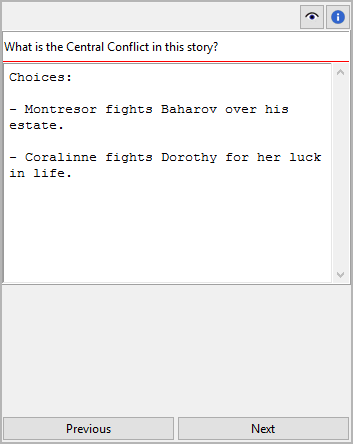

Project note properties
=======================

The Project note properties view opens in the right pane when you
select a project note in the tree.

Title and content
-----------------

Title and content are displayed in an editable "index card".

The editing of the title can be completed by pressing the ``Enter`` key.
Changes to the content are applied when the mouse is clicked
anywhere outside the text input field.

Links
-----

Expand or collapse this frame by clicking on the label.

.. figure:: _images/world_view02.png
   :alt: Screenshot
   
This is a list for image and research document links.

Although *novelibre* holds some character/location/item data, it is
not the right application for extensive world building. For this,
you may want to use more powerful software, like `Zim Desktop Wiki
<https://zim-wiki.org/>`__. In this case, *novelibre* allows you to
create links to the text files that will take you quickly to the right
places in the wiki.

Or you have collected some images that could inspire you when writing.
Then simply create links to these images to open them with your
system's standard image viewer.

.. tip::
   If you have collected several images for a character in a folder 
   that your standard image viewer can browse through, a single link 
   to any image file is sufficient.  
   
The links are displayed in a list in the order they are entered.

Add Link
   When clicking on |Add|, a file selection dialog opens. The selected
   file will be added to the link list.

   .. hint::
      By default, the dialog shows image files. For other file types, 
      change the selector in the lower right corner. 
      
      .. figure:: _images/filePicker01.png
         :alt: Screenshot
         
         Windows 10 Explorer screenshot

Remove Link
   When clicking on |Remove| or pressing the ``Del`` key,
   the selected link is removed from the list.

Open Link
   When double-clicking on a link, or clicking on |Goto|,
   the link is opened with the standard application for the link's file type.

   .. hint::
      If you want to open certain linked files with another application than the 
      standard application, you can provide a *novelibre* "launcher" setting. 
      For this, just create a text file named **launchers.ini** in the 
      ``.novx/config``  directory (where all configuration files are stored).
      Here you can assign applications to the file extensions.
      
      Zim desktop wiki pages are a special case. 
      For this, the Zim program is assigned to the `.zim` extension. 
      
      This example shows a setting that makes *novelibre* open text files
      with the *Zim Desktop Wiki* application instead of the standard text 
      editor: 
      
      ::
     
         [SETTINGS]
         .zim = C:/Program Files (x86)/Zim Desktop Wiki/zim.exe 
         
      .. figure:: _images/launchers.png
         :alt: Screenshot
         
         Windows 10 Explorer screenshot

.. |Add| image:: _images/add.png
.. |Goto| image:: _images/goto.png
.. |Remove| image:: _images/remove.png

Navigation buttons
------------------

- **Previous** moves the selection to the previous project note in the tree.
- **Next** moves the selection to the next project note in the tree.
