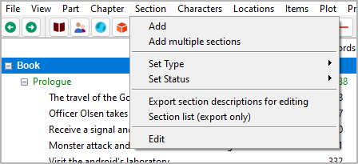
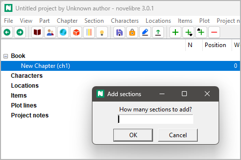
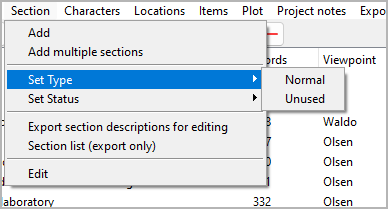
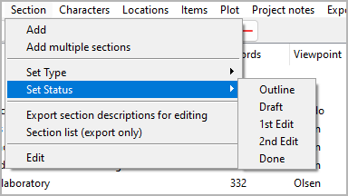

Section menu
============

**Section operation**

Add
---

**Add a new section**

With **Section > Add**,
you can add a `section <basic_concepts.html#sections>`__ to the tree.

- The new section is placed at the next free position after the selection, if
  possible.
- Otherwise, no new section is generated.
- The new section has an auto-generated title. You can change it in
  the right pane.

Properties of a new section:
   -  *Normal* type
   -  *Outline* completion status
   -  No viewpoint character assigned
   -  No plot line or tag assigned
   -  No date/time set

Add multiple sections
---------------------

**Add new sections in bulk**

With **Section > Add multiple sections**,
you can add up to 20 sections to the tree.

- You will be prompted to enter the number of new sections.
- The number of sections to be added at once is limited to 20.
- The new sections are placed at the next free position after the selection, if
  possible.
- Otherwise, no new section is generated.

Set Type
--------

**Set the type of the selected section**

With **Section > Set Type**,
you can set the `type <basic_concepts.html#part-chapter-section-types>`__
of the selected section to *Normal* or *Unused* .

.. hint::

   Type change for multiple sections:
      - Either select multiple sections, or
      - select a chapter.

Set Status
----------

**Set the section completion status**

With **Section > Set Status**,
you can set the `completion status
<basic_concepts.html#section-completion-status>`__
of the selected section to *Outline*, *Draft*, *1st Edit*, *2nd Edit*,
or *Done*.

.. hint::

   Status change for multiple sections:
      -  Either select multiple sections, or
      -  select a parent node (chapter or Book)

Export section descriptions for editing
---------------------------------------

**Export an ODT document that can be imported again after editing**

With **Export section descriptions for editing**,
you can create a text document with a **full synopsis** containing
part/chapter headings and section descriptions
that can be edited and reimported.
File name suffix is ``_sections_tmp``.

Section list (export only)
--------------------------

**Export an ODS document**

With **Section list (export only)**,
you can create a spreadsheet with a row per section, containing
the following data:

- The section ID as a hyperlink to the section in the manuscript (if any)
-  Section title
-  Section description
-  Narrative date
-  Narrative time
-  Tags
-  Section notes
-  A/R
-  Goal
-  Conflict
-  Outcome
-  Sequential section number
-  Words total
-  Word count
-  Characters
-  Locations
-  Items

.. note::
   Only "normal" sections appear in the section list. 
   Sections of the "Unused" type are omitted.

File name suffix is ``_sectionlist``.

