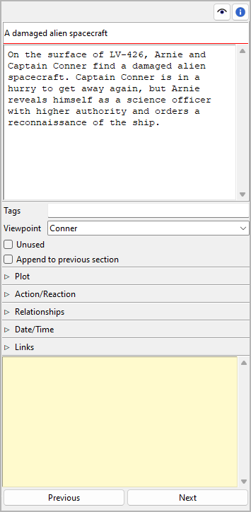
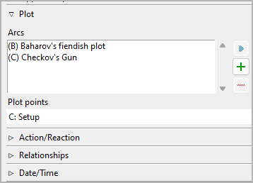
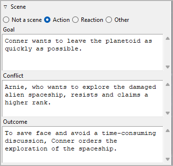
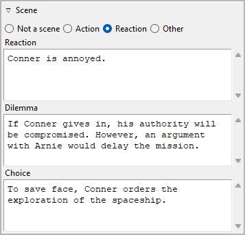
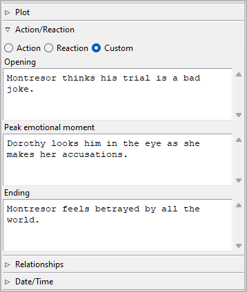
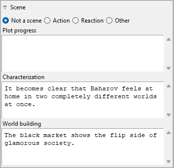
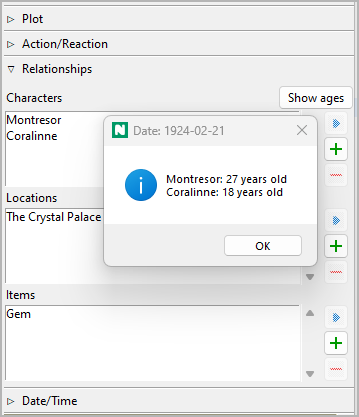
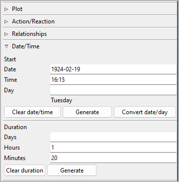
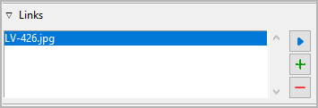

Section properties
==================

The Section properties view opens in the right pane when you
select a section in the tree.

Title and description
---------------------

Title and description are displayed in an editable "index card".

The editing of the title can be completed by pressing the ``Enter`` key.
Changes to the description are applied when the mouse is clicked
anywhere outside the text input field.

Tags
----

Tags are a very freely usable tool for labeling sections in the
tree view. Tags do not have to be defined elsewhere, but simply
entered in the input field separated by semicolons.
Editing can be completed by pressing the ``Enter`` key.

.. caution::
   If you want to use a tag more than once, make sure you use 
   the same spelling in the different places. 

Viewpoint
---------

The viewpoint character's short name is displayed in the tree view.
You can select it from a drop-down list containing all characters
in the tree view's sort order.

Unused
------

With the **Unused** checkbox, you can change the `section type
<basic_concepts.html#part-chapter-section-types>`__.

Append to previous section
--------------------------

When ticked, there will be no section divider inserted above
the selected section in exported documents. The section
just starts a new paragraph.

Plot
----

Expand or collapse this frame by clicking on the label.

Plot lines
~~~~~~~~~~

Here you can assign the selected section to the plot lines it belongs to.
The assigned plot lines are displayed in a list in the order they are
assigned to the section.

.. tip::
   A more convenient way to manage and keep track of plot line assignments is 
   offered by the `nv_matrix plugin 
   <https://github.com/peter88213/nv_matrix/>`__. 
   
   You can also assign a section to a plot line by entering text
   in the corresponding *Plot line notes* cell of the 
   `plot grid <plotting.html#plot-grid>`__. 

Add plot line assignment
   When clicking on |Add|, the "Pick mode"
   is activated, and the cursor changes to a "plus" shape. By clicking
   on a plot line, it will be related with the section.

   .. hint::
      You can exit the "Pick mode" without selecting an element by
      clicking on the highlighted status bar, or by pressing the ``Esc``
      key. 

Remove plot line assignment
   When clicking on |Remove| or pressing the ``Del`` key,
   the selected plot line is removed from the list.

View the related element
   When double-clicking on a plot line, or clicking on |Goto|,
   the selected plot line is opened and its properties are displayed.

   .. hint::
      You can go back to the initially selected section with |Go Back|. 

Plot line notes
   You can enter section-related notes for the plot line selected
   in the list of related plot lines. These notes appear in the
   `plot grid <plotting.html#plot-grid>`__ where you also can
   edit them.

Plot points
~~~~~~~~~~~

The plot points assigned with the selected section are displayed
along with their plot lines.

.. hint::
   To change or clear the plot point assignment, go to the
   `plot point's properties <point_view.html#assigned-section>`__.

Scene
-----

Expand or collapse this frame by clicking on the label.

   Example of an "action scene"

   Example of a "reaction scene" or "sequel"

There is a popular theory for "selling writers" that suggests novels
are best divided into scenes, alternating between "action scenes" and
"reaction scenes", or "scenes" and "sequels". If you want to implement
something like this to ensure suspense, you can do so here.

If this is not for you, but you would like to use a different method
to set up a dramaturgical scene micro-structure, you can set the section
to **Other**, and get three `freely named <book_view.html#renamings>`_
text fields.

   
   Example of a non-standard scene category

On the other hand, not every section is a scene to which the categories
mentioned above apply. Sections can be characterized by mode of discourse
(e.g. Narration, Dramatic action, Dialogue, Description, Exposition).
So if a section is not staged, you can set the section to **Not a scene**,
and get three `freely named <book_view.html#renamings>`_
text fields.

   
   Example of a non-staged section category

Relationships
-------------

Expand or collapse this frame by clicking on the label.

If you want to associate characters, locations, and items with the
section, you can do it here by adding the element to a list of
relationships.

Show ages
   If a section is dated, you can call up the ages of the related
   characters who have `birth dates <character_view.html#bio>`__.

Add Relationship
   When clicking on |Add|, the "Pick mode"
   is activated, and the cursor changes to a "plus" shape. By clicking
   on a character/location/item, this element will be related with the
   section.

   .. hint::
      You can exit the "Pick mode" without selecting an element by
      clicking on the highlighted status bar, or by pressing the ``Esc``
      key. 

Remove Relationship
   When clicking on |Remove| or pressing the ``Del`` key,
   the selected relationship is removed from the list.

View the related element
   When double-clicking on a related element, or clicking on |Goto|,
   the selected element is opened and its properties are displayed.

   .. hint::
      You can go back to the initially selected section with |Go Back|. 

.. hint::
   A convenient way to manage and keep track of relationships is offered 
   by the `nv_matrix plugin 
   <https://github.com/peter88213/nv_matrix/>`__. 

.. |Add| image:: _images/add.png

.. |Remove| image:: _images/remove.png
.. |Go back| image:: _images/goBack.png

Date/Time
---------

Here you can enter information about the selected section's narrative time.
Editing can be completed by pressing the ``Enter`` key.

.. hint::
   Dedicated timeline software offers a more convenient way of entering date/time 
   and duration information. So if chronology is important to your story, you
   might want to take a look at the `Timeline plugin 
   <https://github.com/peter88213/nv_timeline/>`__, or the 
   `Aeon Timeline 2 plugin <https://github.com/peter88213/nv_aeon2/>`__.

Start
~~~~~

If the selected section is a scene, this is when it starts:

Date
   Format: *YYYY-MM-DD*, according to ISO 8601.

Time
   Format: *hh:mm*, according to ISO 8601.

Day
   Format: Any number. Day "0" is the `reference date
   <book_view.html#narrative-time>`_, if set.

.. note::
   All entries are optional. You can either enter a date, or a day. 

Moon phase
   If the required date information is set, you can call up the corresponding moon phase.

   .. figure:: _images/section_view09.png
      :alt: Screenshot

   The moon phase information consists of:

   - the phase day (0 to 29, where 0=new moon, 15=full etc.),
   - the visible shape,
   - the fraction illuminated.

   .. note::
      The moon phase calculation is based on a ‘do it in your head’ algorithm
      by John Conway. In its current form, it’s only valid for the 20th and
      21st centuries.

Clear date/time
   This will reset *Date*, *Time*, and *Day* simultaneously.

Generate
   This generates date and time from the date/time/duration data of the
   `previous section <Navigation buttons_>`_, so the selected section
   follows directly the previous one.

Convert date/day
   If the `reference date <book_view.html#narrative-time>`__ is set,
   The unspecific *Day* can be transformed into a specific *Date*,
   and vice versa.

   .. hint::
      If necessary, you can convert all sections at once in the 
      `Book properties view <book_view.html#narrative-time>`__.
   

Duration
~~~~~~~~

Days
   Any number should be accepted.

Hours
   If a number greater than 24 is entered, the number of days
   will be automatically increased.

Minutes
   If a number greater than 60 is entered, the number of hours
   will be automatically increased.

Clear duration
   This will reset *Days*, *Hours*, and *Minutes* simultaneously.

Generate
   This generates the duration from the date/time data of the
   `next section <Navigation buttons_>`_, so the next section
   follows directly the current one.

Links
-----

Expand or collapse this frame by clicking on the label.

   
This is a list for image and research document links.

Although *novelibre* holds some character/location/item data, it is
not the right application for extensive world building. For this,
you may want to use more powerful software, like `Zim Desktop Wiki
<https://zim-wiki.org/>`__. In this case, *novelibre* allows you to
create links to the text files that will take you quickly to the right
places in the wiki.

Or you have collected some images that could inspire you when writing.
Then simply create links to these images to open them with your
system's standard image viewer.

.. tip::
   If you have collected several images for a character in a folder 
   that your standard image viewer can browse through, a single link 
   to any image file is sufficient.  
   
The links are displayed in a list in the order they are entered.

Add Link
   When clicking on |Add|, a file selection dialog opens. The selected
   file will be added to the link list.

   .. hint::
      By default, the dialog shows image files. For other file types, 
      change the selector in the lower right corner. 
      
      .. figure:: _images/filePicker01.png
         :alt: Screenshot
         
         Windows Explorer Screenshot

Remove Link
   When clicking on |Remove| or pressing the ``Del`` key,
   the selected link is removed from the list.

Open Link
   When double-clicking on a link, or clicking on |Goto|,
   the link is opened with the standard application for the link's file type.

   .. hint::
      If you want to open certain linked files with another application than the 
      standard application, you can provide a *novelibre* "launcher" setting. 
      For this, just create a text file named **launchers.ini** in the 
      ``.novx/config``  directory (where all configuration files are stored).
      Here you can assign applications to the file extensions.
      
      Zim desktop wiki pages are a special case. 
      For this, the Zim program is assigned to the `.zim` extension. 
      
      This example shows a setting that makes *novelibre* open text files
      with the *Zim Desktop Wiki* application instead of the standard text 
      editor: 
      
      ::
     
         [SETTINGS]
         .zim = C:/Program Files (x86)/Zim Desktop Wiki/zim.exe 
         
      .. figure:: _images/launchers.png
         :alt: Screenshot
         
         Windows Explorer Screenshot

"Sticky note"
-------------

The yellow text area is for notes. Changes are applied
when the mouse is clicked anywhere outside the text input field.

When the "sticky note" of a section contains text, "N" is
displayed in the tree view as a reminder. If the branch of a chapter
with sections containing notes is collapsed, the "N" is displayed
in the chapter row.

.. note::
   The "sticky notes" are only for working with *novelibre*.
   They are not meant to be exported into a document.
   However, they appear in the `section list`_.

.. _section list: section_menu.html#export-section-list-spreadsheet

Navigation buttons
------------------

- **Previous** moves the selection to the previous section in the tree.
- **Next** moves the selection to the next section in the tree.
