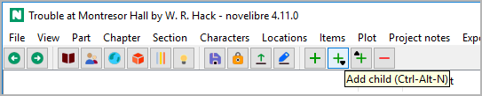

The toolbar
===========

The toolbar provides buttons for common actions in the proposed workflow.

|screenshot|

-----------------

|Go back| Go back in the browsing history.

|Go forward| Go forward in the browsing history.

-----------------

|Show Book| Go to the "Book" branch and expand it.
Same as **View > Show Book**.

|Show Characters| Go to the "Characters" branch and expand it.
Same as **View > Show Characters**.

|Show Locations| Go to the "Locations" branch and expand it.
Same as **View > Show Locations**.

|Show Items| Go to the "Items" branch and expand it.
Same as **View > Show Items**.

|Show Plot lines| Go to the "Plot lines" branch and expand it.
Same as **View > Show Plot lines**.

|Show Project notes| Go to the "Project notes" branch and expand it.
Same as **View > Show Project notes**.

-----------------

|Save| Save the project. Same as **File > Save** or ``Ctrl``-``S``.

|Lock/Unlock| Toggle the lock status of the project.

|Update from manuscript| Import the current manuscript.
Same as selecting the manuscript under **Import**.

|Export manuscript| Export the manuscript for editing.
Same as **Export > Manuscript for editing**,
but without confirmation for opening the document.

-----------------

|Add| Add element.
Same as ``Ctrl``-``N``.

|Add child| Add child element.
Same as ``Ctrl``-``Alt``-``N``.

|Add parent| Add element on the parent’s level.
Same as ``Ctrl``-``Alt``-``Shift``-``N``.

|Delete| Delete selected elements.
Same as ``Del``.

-----------------

|Toggle Text viewer| Toggle Text viewer.
Same as **View > Toggle Text viewer** or ``Ctrl``-``T``.

|Toggle Properties| Toggle Properties.
Same as **View > Toggle Properties** or ``Ctrl``-``Alt``-``T``.

.. |Go forward| image:: _images/goForward.png
.. |Show Book| image:: _images/viewBook.png

.. |Show Items| image:: _images/viewItems.png
.. |Show Plot lines| image:: _images/viewArcs.png

.. |Add| image:: _images/add.png
.. |Add child| image:: _images/addChild.png
.. |Add parent| image:: _images/addParent.png
.. |Delete| image:: _images/remove.png

.. |Toggle Properties| image:: _images/properties.png
