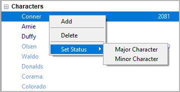
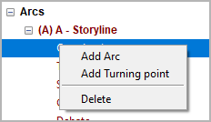

Tree view context menu
======================

When right-clicking on a tree element in the left pane, a context menu
opens.

Greyed-out entries are not available, e.g. due to “project lock”.

Book context menu entries
-------------------------

.. figure:: _images/contextMenu01.png
   :alt: noveltree screenshot

Add Section
~~~~~~~~~~~

Adds a new section.

-  The new section is placed at the next free position after the
   selection.
-  The new section has an auto-generated title. You can change it in the
   right pane.

Properties of a new section
   -  *Normal* type
   -  *Outline* completion status
   -  No viewpoint character assigned
   -  No arc or tag assigned
   -  No date/time set

Add Chapter
~~~~~~~~~~~

Adds a new chapter.

-  The new chapter is placed at the next free position after the
   selection.
-  The new chapter has an auto-generated title. You can change it in the
   right pane.

Add Part
~~~~~~~~

Adds a new part.

-  The new part is placed at the next free position after the selection.
-  In the tree, the part is at the same level as the chapters, so the
   chapters are not children of the part. This is to make it easier to
   move the part boundaries.
-  The new part has an auto-generated title. You can change it in the
   right pane.

Insert Stage
~~~~~~~~~~~~

Inserts a new stage at the next free position at stage level after the
selection.

-  The new stage has an auto-generated title. You can change it in the
   right pane.
-  The new stage is on the second level by default.

Change Level
~~~~~~~~~~~~

Changes the level of a chapter or a stage.

-  **1st Level** converts a selected part into a chapter.
-  **2nd Level** converts a selected chapter into a part.

Delete
~~~~~~

Deletes the selected tree element and its children.

-  Parts and chapters are deleted.
-  Sections are marked “unused” and moved to the “Trash” chapter.
-  Deleting a part has no effect on its subordinate chapters.
-  Deleting a chapter moves its sections to the “Trash” chapter.
-  The “Trash” chapter is created automatically, if needed.
-  When deleting the “Trash” chapter, all its sections are deleted.

Set Type
~~~~~~~~

Sets the `type <basic_concepts.html#part-chapter-section-types>`__
of the selected chapter or section.
This can be *Normal* or *Unused*.

.. note::
   Setting the type of a chapter to *Unused* will also make its sections *Unused*.

Set Status
~~~~~~~~~~

Sets the `completion status <basic_concepts.html#section-completion-status>`__
of the selected section.

.. hint::
   Select a parent node to set the status for multiple sections.

Join with previous
~~~~~~~~~~~~~~~~~~

Joins two sections, if within the same chapter, of the same type, and
with the same viewpoint.

-  New title = title of the prevoius section & title of the selected
   section
-  The section contents are concatenated, separated by a paragraph
   separator.
-  Descriptions are concatenated, separated by a paragraph separator.
-  Goals are concatenated, separated by a paragraph separator.
-  Conflicts are concatenated, separated by a paragraph separator.
-  Outcomes are concatenated, separated by a paragraph separator.
-  Notes are concatenated, separated by a paragraph separator.
-  Character lists are merged.
-  Location lists are merged.
-  Item lists are merged.
-  Arc assignments are merged.
-  Turning point associations are moved to the joined section,
   if any.
-  Section durations are added.

.. caution::
   Be aware, there is no “Undo” feature.

Chapter level
~~~~~~~~~~~~~

Hides the sections by collapsing the tree, so that only parts and
chapters are visible.

Expand
~~~~~~

Shows a whole branch by expanding the selected tree element.

Collapse
~~~~~~~~

Hides the child elements of the selected tree element.

Expand all
~~~~~~~~~~

Shows the whole tree.

Collapse all
~~~~~~~~~~~~

Hides all tree elements except the main categories.

Characters/Locations/Items context menu entries
-----------------------------------------------

Add
~~~

Adds a new character/location/item.

-  The new element is placed after the selected one.
-  The new element has an auto-generated title. You can change it in the
   right pane.
-  The status of newly created characters is *minor*.

Delete
~~~~~~

Deletes the selected character/location/item.

.. caution::
   Be aware, there is no “Undo” feature.

Set Status
~~~~~~~~~~

Sets the selected character’s status. This can be *major* or *minor*.
Major characters are highlighted in the tree view.

.. note::
   The character status is only for visual distinction. It has no
   influence on the program functions. Nevertheless, you can use it
   to mark viewpoint characters or characters with their own arcs.

.. hint::
   Select the *Characters* root node to set the status for all characters.

Arcs context menu entries
-------------------------

Add Arc
~~~~~~~

Adds a new story arc

-  If an arc is selected, the new item is placed after the selected one.
-  Otherwise, the new arc is placed at the last position.
-  The new arc has an auto-generated title. You can change it in the
   right pane.

Add Turning point
~~~~~~~~~~~~~~~~~

Adds a new Turning point

- If a turning point is selected, the new turning point is placed after
  the selected one.
- If an arc is selected, the new turning point is placed at the last position.
- Otherwise, no new turning point is generated.
- The new turning point has an auto-generated title. You can change it in
  the right pane.

Delete
~~~~~~

Deletes the selected arc/turning point.

.. caution::
   Be aware, there is no “Undo” feature. If you delete an arc, all its
   turning points will be deleted, too.
   
   

   