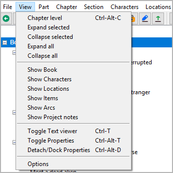
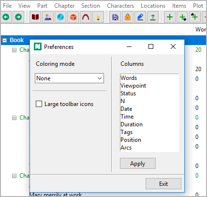

View menu
=========

**Control the display**

Chapter level
-------------

**Hide the sections**

with **View > Chapter level** or ``Ctrl``-``Alt``-``C``,
you can collapse the tree, so that only parts and chapters are visible.

Expand selected
---------------

**Show a whole branch**

With **View > Expand selected**,
you can expand a selected tree element.

Collapse selected
-----------------

**Hide child elements**

With **View > Collapse selected**,
you can collapse a selected branch.

Expand all
----------

**Show the whole tree**

With **View > Expand all**,
you can expand the whole tree.

Collapse all
------------

**Hide child elements**

With **View > Collapse all**,
you can hide all tree elements except the main categories.

Show Book
---------

**Go to the "Book" branch and expand it**

With **View > View Book**,
you can select and open the "Book" branch.

Show Characters
---------------

**Go to the "Characters" branch and expand it**

With **View > View Characters**,
you can select and open the "Characters" branch.

Show Locations
--------------

**Go to the "Locations" branch and expand it**

With **View > View Locations**,
you can select and open the "Locations" branch.

Show Items
----------

**Go to the "Items" branch and expand it**

With **View > View Items**,
you can select and open the "Items" branch.

Show Plot lines
---------------

**Go to the "Plot lines" branch and expand it**

With **View > Show Plot lines**,
you can select and open the "Plot lines" branch.

Show Project notes
------------------

**Go to the "Project notes" branch and expand it**

With **View > View Planning**,
you can select and open the "Project notes" branch.

Toggle Text viewer
------------------

**Show/hide the novel text**

With **View > Toggle Text viewer** or ``Ctrl``-``T``,
you can open or close the `text viewer <desktop.html>`__ window,
showing part/chapter/section titles and section content.

.. hint::

   -  On reopening, the windows shows the text, where the tree is selected.
   -  When changing the tree selection, the text moves along.
   -  However, the text can be scrolled independently with the verical
      scrollbar, or the mousewheel.
   -  You can select text with the mouse, and copy it to the clipboard with
      ``Ctrl``-``C``.
   -  You cannot edit the text. For this, you might want to install an
      editor plugin, such as
      `nv_editor <https://github.com/peter88213/nv_editor/>`__.

Toggle Properties
-----------------

**Show/hide the selected element’s properties**

With **View > Toggle Properties** or ``Ctrl``-``Alt``-``T``,
you can open or close the element properties window.

.. hint::
   On reopening, the window shows the properties of the currently 
   selected element.

Detach/Dock Properties
----------------------

**Show the selected element’s properties either in the main window or in
its own window**

With **View > Detach/Dock Properties** or ``Ctrl``-``Alt``-``D``,
you can detach or dock the element properties window .

.. hint::
   On closing the detached window, the properties are docked again.

Options
-------

**Project independent program settings**

With **View >  Options**,
You can open a dialog for settings concerning the display.

Coloring mode
~~~~~~~~~~~~~

**Set criteria according to which normal sections are colored in the tree**

None
   Normal sections are black on white by default.

Status
   Normal sections are colored according to their completion status
   (*Outline*, *Draft*, *1st Edit*, *2nd Edit*, or *Done*).

Work phase
   Normal sections are highlighted if their completion status
   is behind the work phase defined in the `Book properties
   <book_view.html#writing-pogress>`__.

Large toolbar icons
~~~~~~~~~~~~~~~~~~~

By default, the icon size is 16x16 pixels. If the *Large toolbar icons*
checkbox is ticked, 24x24 icons are used after the next program startup.

.. note::
   This applies not only to the toolbar, but also to all other
   icons that decorate the application’s control elements.

Columns
~~~~~~~

**Change the column order**

-  From top to bottom in the list means from left to right in the tree.
-  Just drag and drop to change the order.

Click the **Apply** button to apply changes.

