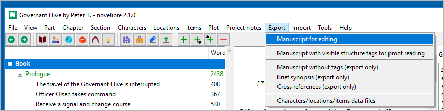
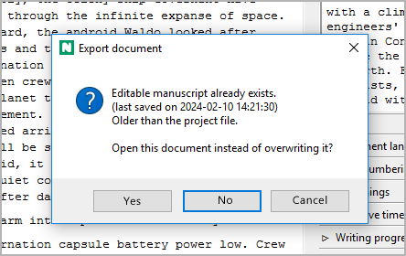
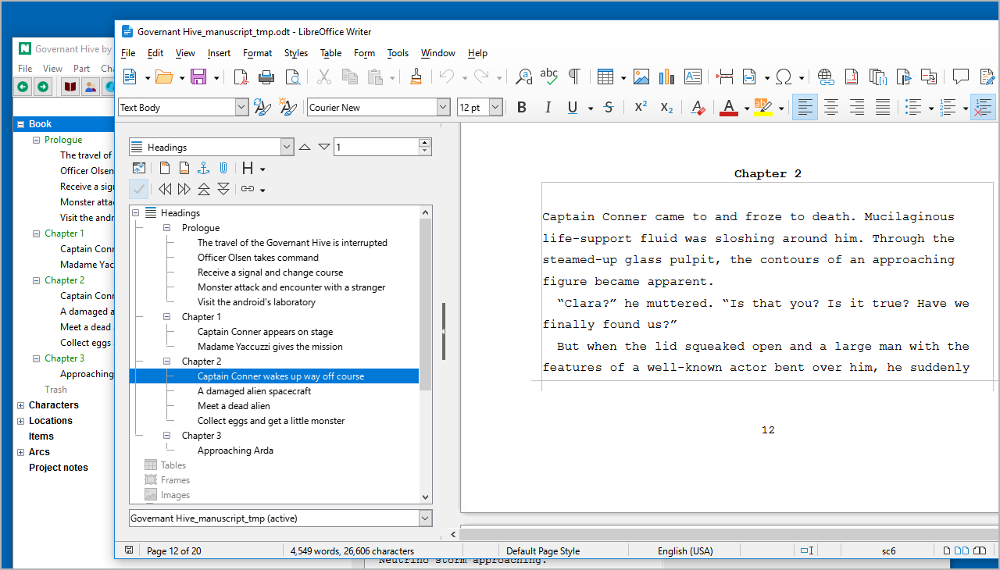
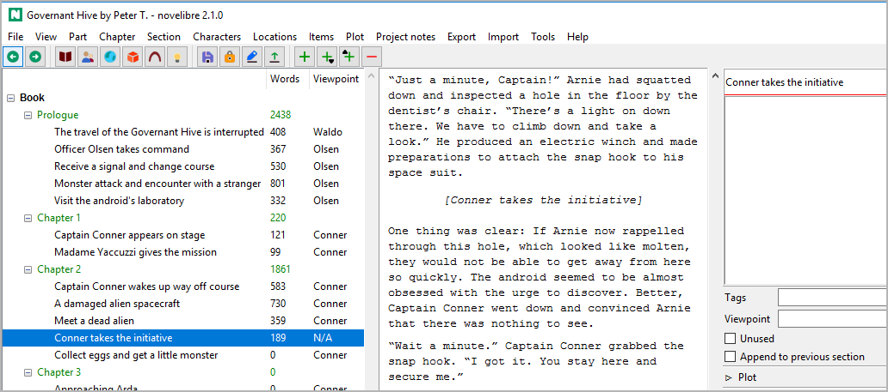
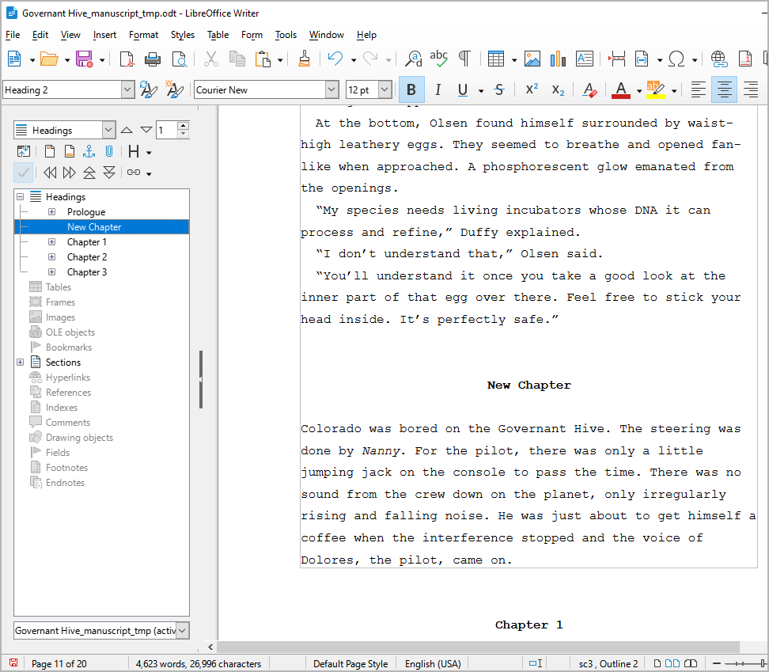
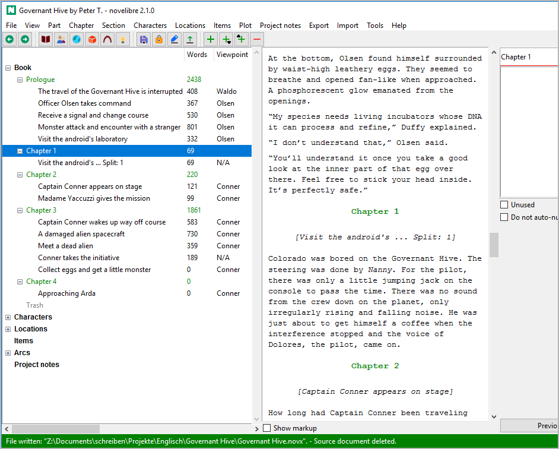

Writing the manuscript
======================

Starting Writer as text editor
------------------------------

.. note::
   The following example describes the manuscript editing workflow 
   with LibreOffice. The same applies to OpenOffice.
   
   Other word processing programs that claim to support the *ODT* 
   file format are generally not recommended. 

As soon as your novel project has at least one section, you can start
writing. For this, you save your project and export your novel
to the *Writer* word processor either with **Export > Manuscript for editing**,
or by clicking on the |Export manuscript| toolbar icon.

.. hint::
   - If you use the menu command, you can have *novelibre* create a
     manuscript, and ask whether it should be opened with *Writer*.
   - If you click on the toolbar icon, *Writer* will be launched 
     immediately after export.

   
If you have done this before and there is still a manuscript document from
the previous writing session, you will now be asked whether you want to
continue working on this document. If this is the case, answer "Open existing".

   
If you answer "Overwrite", *novelibre* creates a new manuscript document.
"Cancel" aborts the export process and lets you return to the main window.

.. hint::
   *novelibre* checks whether an existing manuscript is newer or older
   than the open project, and suggests a choice by activating the 
   appropriate button. You can accept it by hitting the ``Enter`` key.
   If your choice follows the suggestion, you see a message in green
   at the status bar. Otherwise, the message is displayed in red, 
   just as a reminder. 

If you started the export using the **Export** menu command, you may
be asked whether you want to open the newly created document, depending
of your `Export settings <export_menu.html#options>`__.

.. image:: _images/writing03.png
   :alt: novelibre screenshot
    
If you answer "yes", *Writer* will be launched with
the manuscript document. Otherwise, the document is just
kept for future use.

Depending on your `Export settings <export_menu.html#options>`__,
*novelibre* now may `lock the project <basic_concepts.html#project-lock>`__,
so that it can't be accidentally modified with *novelibre* while
worked on in *Writer*.

.. note::
   *novelibre* starts your standard application for files with the *.odt* 
   extension. Usually, the setting is made by LibreOffice or OpenOffice
   during installation.

After you change to *Writer*, you see the whole novel in
a layout that is similar to the "standard manuscript format". The
*Navigator* (open with ``F5``) shows the chapter and section titles
in the *Headings* area. Double click on a heading to move the cursor
to that location. You can now write within the frames that define
the sections.

The following picture shows a LibreOffice Writer screenshot.
Note that the text boundaries are made visible here,
which is `highly recommended <preparations.html#setting-up-writer>`__.

   
.. note::
   The section titles displayed in the Navigator are invisible 
   in the workspace so that they do not disrupt the flow of writing, 
   and the impression of an original manuscript page is retained. 
 

Writing changes back to novelibre
---------------------------------

At the end of the writing session, save the changes, exit the *Writer*
word processor, and return to *novelibre*. Simply click on the
|Update from manuscript| toolbar icon, and your latest changes will
appear.

.. note::
   The toolbar icon mentioned above is only for the manuscript. If 
   you want to apply changes made in other documents like character
   sheets or synopses, use the `Import menu <import_menu.html>`__. 

Creating new sections with Writer
---------------------------------

If you need a new section while writing, you don't have to switch
to *novelibre*. Simply start a new line with a special marker
``###``. Optionally, you can add a section title, and, separated
by ``|``, a section description. All other metadata is intended
to be entered in *novelibre* later.

.. tip::
   You can use ``####`` to create an `appended section 
   <section_view.html#append-to-previous-section>`__. 

The following example shows how to split an existing section:

The following picture shows a LibreOffice Writer screenshot.
Notice the highlighted section marker

.. image:: _images/writing05.png
   :alt: LibreOffice Writer screenshot
   
Back in *novelibre*, you see the new section. It has got a title,
but no other metadata.

   
Notice the selected new section in the screenshot.

Creating new chapters with Writer
---------------------------------

If you need a new chapter while writing, you don't have to switch to
*novelibre*. Simply assign a new line *within the edited section*
the **Heading 2** style.

.. important::
   *novelibre* only reimports text within section defining frames. 
   Technically, it always splits sections when creating new chapters 
   or sections from the manuscript.
   
   You also cannot move chapters within *Writer*. If you 
   want to rearrange chapters or sections, do it with *novelibre*.  
   

The following example shows how to add a chapter with *Writer*:

   
It doesn't matter what the new chapter is titled.

Back in *novelibre*, you see a new chapter and a new section. Since
the chapters are auto-numbered in this example project, the new
chapter title already fits, while the new section's title should
be adjusted manually.

   

.. |Export manuscript| image:: _images/manuscript.png
.. |Update from manuscript| image:: _images/updateFromManuscript.png
